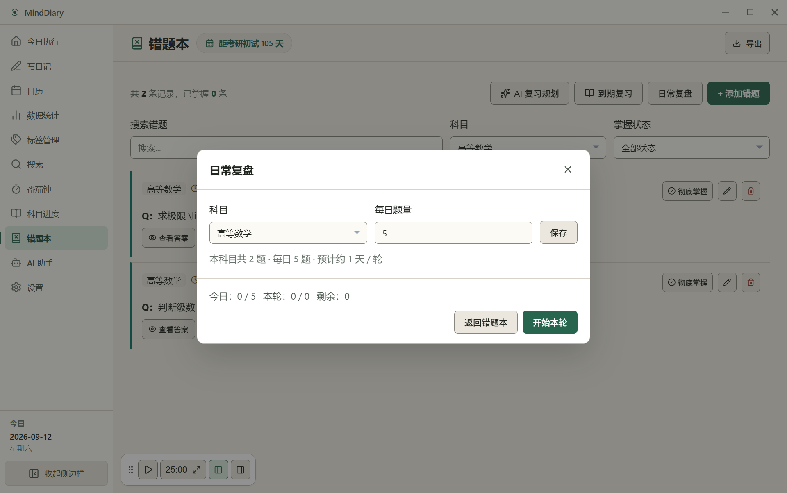

<p align="center">
  
</p>

<h3 align="center">MindDiary</h3>

<p align="center">
  低压力 · 长周期 · 本地优先的考研学习伴侣
</p>

<p align="center">
  把今日任务、专注、错题复习、日记与可控 AI 串成一个学习闭环。
</p>

<p align="center">
  <a href="https://github.com/gakialter/Minddiary/actions/workflows/ci.yml"></a>
  <a href="https://github.com/gakialter/Minddiary/actions/workflows/release.yml"></a>
  <a href="https://github.com/gakialter/Minddiary/releases/latest"></a>
  <a href="./LICENSE"></a>
  <a href="https://www.typescriptlang.org/"></a>
</p>

---

## 产品理念

**Less but better. Action first, noise last.**

面向长周期的考试备考不是短跑冲刺，而是跨越数月甚至整年的节奏守护。MindDiary 不做过度复杂的项目管理，也不做诱发焦虑的数据打卡，而是以低心智负担为原则，让工具退居幕后，使用者的每一次专注与复习才是画面的主角。

MindDiary 坚持 **本地优先（Local-first）** 与数据自主。学习任务、专注记录、错题库和日记全部保存在本地 SQLite 数据库中，完全离线可用，零云端强制依赖。

在此之上，MindDiary 串联起「今日执行 → 专注计时 → 错题复习 → 日记沉淀」的学习行为闭环。AI 的定位是辅助决策与候选生成，绝不自主写库；所有 AI 生成的内容均遵循「候选呈现 → 本地校验 → 用户确认」原则，始终由用户掌握最终控制权。

---

## 界面预览

<p align="center">
  
</p>

<p align="center">
  
  
</p>

<p align="center">
  
  
</p>

<p align="center">
  
  
</p>

<p align="center">
  
</p>

---

## 核心体验

### 1. 今日执行
- **今日行动队列**：跟踪管理今日任务（`todo` / `doing` / `done` / `skipped`），清晰区分手动创建、到期错题推荐与 AI 规划候选。
- **科目与章节关联**：任务可绑定具体科目及详细章节，勾选完成即时更新章节进度并联动备考大盘。
- **AI 今日行动建议**：根据备考进度与历史复盘生成候选任务，经本地严格类型校验后，由用户自由编辑、勾选并确认写入。
- **今日闭环指标**：看板实时对比「计划预计时长」与「实际专注时长」，直观呈现今日任务完成率与专注覆盖率。
- **专注一键联动**：直接从待办任务启动关联专注，任务状态自动流转至 `doing`，结束时引导闭环结算。

### 2. 专注
- **多样专注模式**：支持标准番茄倒计时、自定义时长（1–120 分钟）、短休、长休以及开放式正计时（至少 1 分钟有效记录）。
- **任务与科目绑定**：开始专注前可指定关联任务与科目，专注时间自动归因到对应学科与学习目标。
- **提前结束安全结算**：有效专注满 1 分钟即可提前结束并按实际运行时间计入统计（暂停时长自动扣除），保护突发打断下的专注成果。
- **Zen 全屏专注**：极简全屏沉浸空间，仅保留时钟、当前任务与科目，支持键盘快捷退出与中断防丢保护。
- **闭环结算沉淀**：专注结束后可一键标记任务完成、追加一句话复盘至今日日记，或直接跳转记录错题。

### 3. 错题与复习
- **结构化错题管理**：记录问题、答案解析与富文本备注；题目图片与答案图片分区存储，答案与解析默认折叠。
- **SM-2 间隔重复到期复习**：依据艾宾浩斯记忆规律与 SM-2 算法安排下次复习，评分完成后自动结算关联的复习任务。
- **独立「日常复盘」**：按科目独立设定每日刷题配额（Quota），采用不放回轮次机制，支持跨日续做与显式开启下一轮，复盘过程完全不改写 SM-2 间隔与掌握度。
- **多维度检索与状态流转**：支持按科目筛选、关键词检索、掌握状态（未掌握 / 已掌握）筛选，以及一键查看「今日待复习」清单。

### 4. 日记
- **CodeMirror 6 Live Preview**：单编辑面实时渲染，在打字与编辑时即时预览格式，光标进入语法范围时显式展开标记，兼具纯文本的高效与富文本的直观。
- **安全富文本排版**：支持原生 Markdown 语法，以及白名单受控的加粗、下划线、高亮与多色高亮标注（如 `{color:green}`）。
- **选区悬浮工具栏**：划词即刻唤起轻量格式栏，支持快捷键（`Mod-B` / `Mod-U` / `Mod-Shift-H`）与完整的 Undo / Redo 操作历史。
- **标准 Markdown 存储**：底层始终存储规范纯文本 Markdown，无专有私有格式锁定，日记内容导出或迁移零壁垒。
- **自动保存与智能辅助**：输入过程静默自动保存，支持按日期回溯；配置 AI 后支持一键「AI 汇总」与针对划选文字的局部润色。

### 5. AI 助手
- **考研助教小研**：支持自由对话交流、今日日记总结、错题规律分析、知识点考考我、心理疏导与复习冲刺规划。
- **候选优先与确认写入**：Today Action、Daily Review 与选区润色均以候选形式呈现，必须由用户审阅、确认后才执行本地持久化。
- **选区润色最小上下文**：日记选区润色仅发送用户选中的连续正文片段（限 4000 字符以内），不发送日记全文。
- **供应商自由与离线保障**：支持 OpenAI 兼容 API 以及 DeepSeek、通义千问、智谱 GLM、Kimi、豆包、SiliconFlow 等国内主流模型；未配置时完全不影响所有本地核心功能。

> 更多关于边界条件、交互细节与高级配置，请阅读 [MindDiary 用户指南](./docs/USER_GUIDE.md)。

---

## AI 与隐私

MindDiary 将隐私与数据自主置于最高优先级：

- **数据全量本地化**：日记正文、错题题库、专注会话和任务队列均存储在本地 SQLite 数据库中。
- **按需网络交互**：应用不包含任何静默上传或用户行为追踪；仅在用户主动配置并触发 AI 请求或检查更新时才会访问网络。
- **无直接写库权限**：AI 模型输出仅作为结构化候选（Candidates），经本地 JSON Schema 与业务规则双重校验后，由用户显式点击确认才写入数据库。
- **严格上下文边界**：日记选区润色仅发送所选连续文字；每日复盘与今日行动上下文自动排除日记正文、错题答案与 API Key；本地文件路径与附件正文不持久化到聊天历史或备份包中。
- **凭据脱敏安全**：配置的 API Key 存储于受保护的本地设置中，导出备份与 JSON 快照时自动剔除敏感凭据。

---

## 最新版本

### v1.19.1

v1.19.1 是当前稳定发布版本（SQLite Schema 8），在 v1.19.0 的重大架构与交互升级基础上，重点巩固了表单状态一致性与使用稳定性：

- **C8 UI/UX 体验升级**：重构并统一了「今日执行」、错题本、番茄钟、AI 助手及次级工作区的大地色现代栅格视觉与紧凑桌面窗口交互。
- **独立日常复盘（Daily Review）**：错题本新增科目每日题量配额与不放回轮次机制，支持跨日续做与手动轮次流转，与 SM-2 到期复习互不干扰。
- **日记 Live Preview 实时预览**：基于 CodeMirror 6 重构编辑器，实现单编辑面实时格式渲染与选区悬浮工具栏，保留标准 Markdown 纯文本存储。
- **AI 选区局部润色**：日记选中文字即刻唤起表达润色、精简、纠正语病与原意改写，原文变动自动失效，支持一键撤销应用。
- **错题本状态同步加固**：修复错题编辑表单在异步状态更新与格式工具栏快速交互时受控字段可能回退的问题，移除挂载时的冗余数据加载。

👉 [查看完整 v1.19.1 Release Notes](./RELEASE_NOTES.md) · [查看历史全部 Releases](https://github.com/gakialter/Minddiary/releases)

---

## 下载与安装

请前往 [GitHub Releases Latest](https://github.com/gakialter/Minddiary/releases/latest) 下载对应操作系统的最新正式安装包：

### Windows
- **安装版**：`MindDiary-Setup-1.19.1.exe`（支持自动更新，保留本地学习数据）
- **便携版**：`MindDiary-1.19.1-win-portable.zip`（解压即用）

### macOS
- **Apple Silicon (ARM64)**：`MindDiary-1.19.1-arm64.dmg` / `MindDiary-1.19.1-arm64-mac.zip`（支持 macOS 12.0+）

> [!NOTE]
> Windows 未签名版本首次运行可能触发 SmartScreen 提示，点击「更多信息 → 仍要运行」即可；macOS 安装包当前为 Ad-hoc 签名，首次打开如遇提示请前往「系统设置 → 隐私与安全性」允许运行。

---

## 本地开发

### 环境要求
- Node.js `>= 22.12.0`
- npm

### 快速开始

```bash
# 克隆仓库
git clone https://github.com/gakialter/Minddiary.git
cd Minddiary

# 安装依赖（自动配置 Electron 原生依赖）
npm install

# 启动本地开发环境
npm run dev
```

### 常用脚本

```bash
# 类型检查
npm run typecheck

# 运行单元测试
npm test

# 运行端到端测试
npm run test:e2e

# 构建当前平台安装包
npm run build
```

### 核心技术栈

- **桌面外壳**：Electron 42 · contextIsolation · 细粒度授权 IPC
- **前端架构**：React 18 · TypeScript (strict) · Vite
- **本地数据库**：better-sqlite3 (WAL 模式，外键级联，Schema 8)
- **日记编辑器**：CodeMirror 6 · 自定义 Markdown 方言扩展 · 实时预览
- **样式与品牌**：CSS Variables · Tailwind utilities · Zen Forest 禅意森林设计体系
- **质量保障**：Vitest · React Testing Library · Playwright E2E

---

## 相关文档

- [用户指南](./docs/USER_GUIDE.md) — 了解每个界面的具体操作流程与功能说明
- [AI Study Planning Agent Roadmap](./docs/roadmap/minddiary-ai-study-agent-roadmap.md) — 了解学习规划闭环与架构演进路线
- [Zen Forest 品牌规范](./docs/assets/brand.md) — 查看色彩、排版与视觉设计原则
- [发布说明 (Release Notes)](./RELEASE_NOTES.md) — 查看版本兼容性、数据库迁移与已知边界
- [发布清单 (Release Checklist)](./docs/release-checklist.md) — 查看构建、签名与多平台打包校验规范

---

## 参与贡献

欢迎提交 [Issue](https://github.com/gakialter/Minddiary/issues) 报告使用问题或提出建议；在提交 Pull Request 前请确保代码通过 `npm run typecheck` 与 `npm test`。

## 许可证

[MIT License](./LICENSE)
