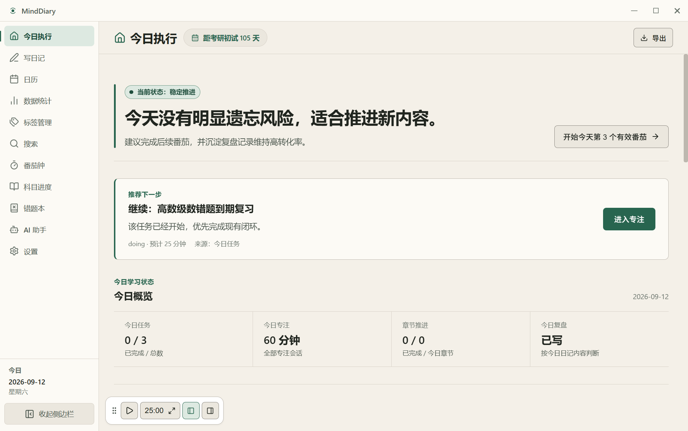
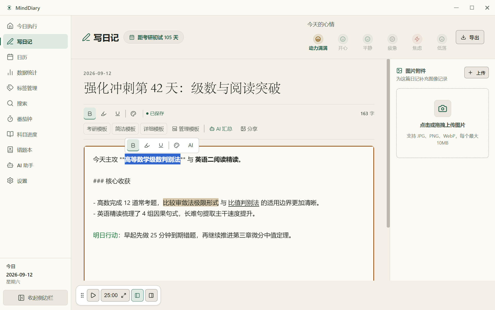
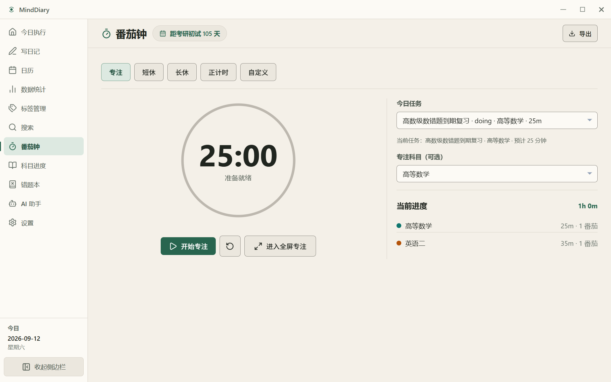
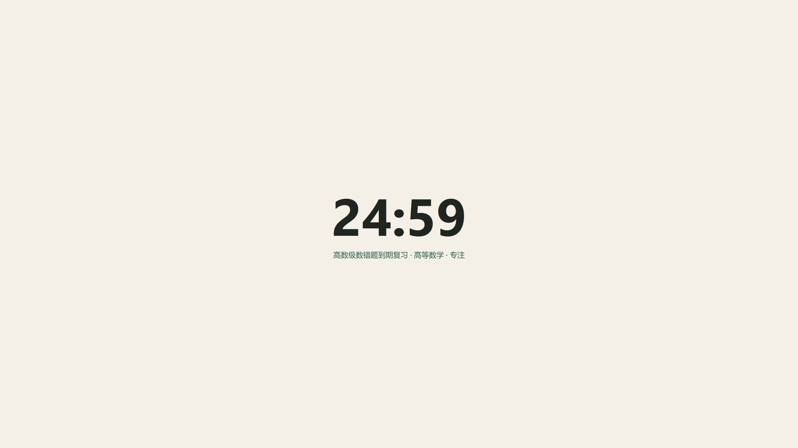
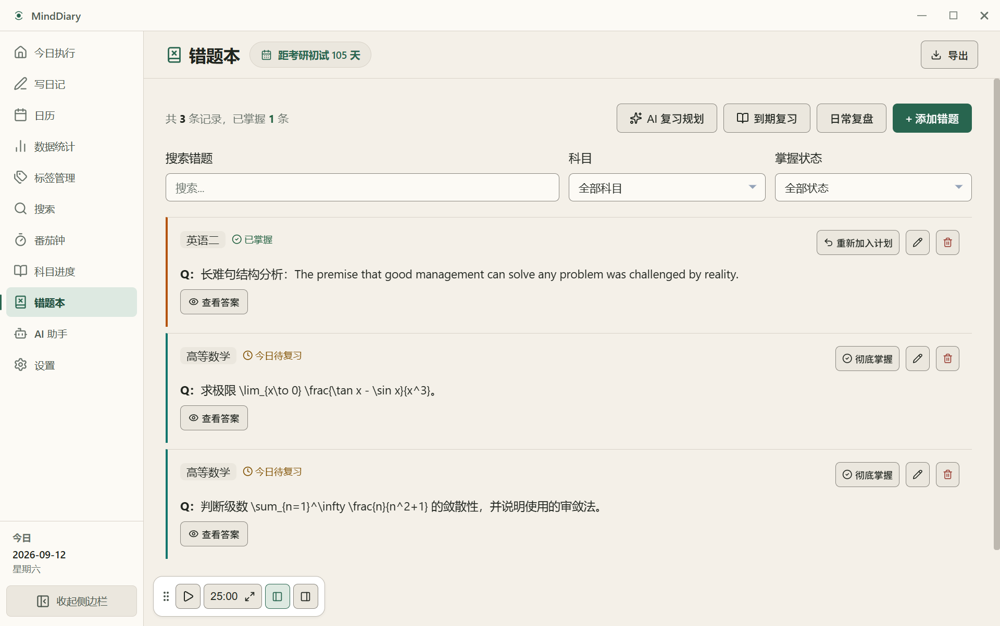
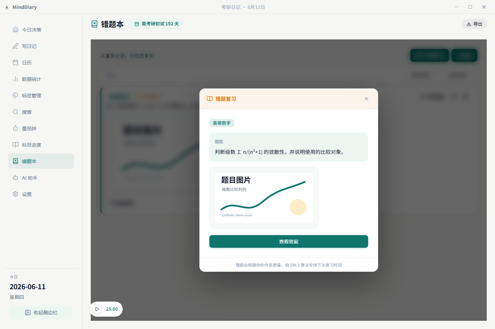
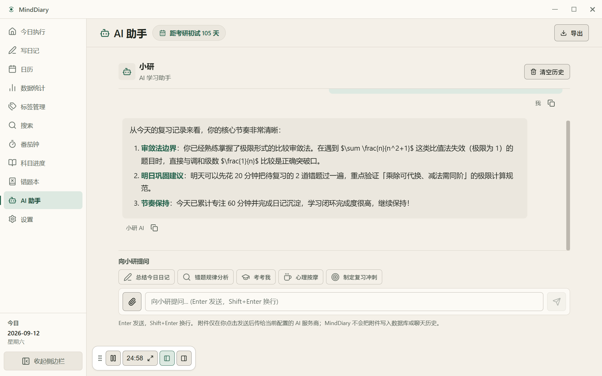
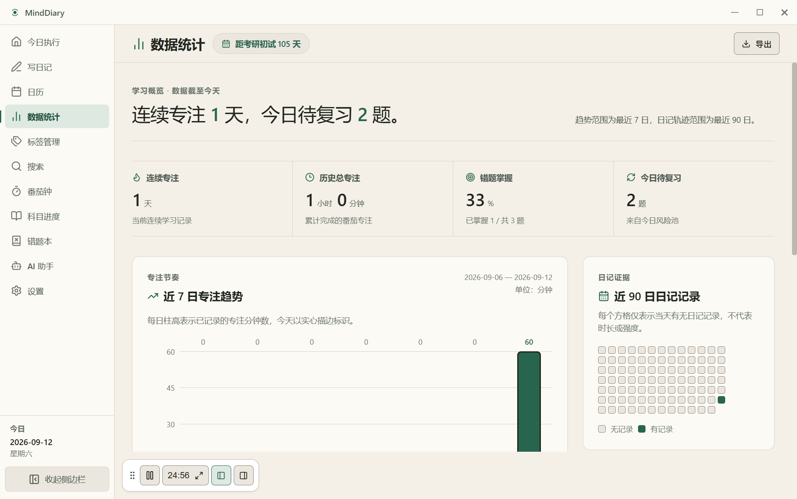

<p align="center">
  
</p>

<h3 align="center">MindDiary</h3>

<p align="center">
  低压力 · 长周期 · 本地优先的考研学习伴侣
</p>

<p align="center">
  <a href="https://github.com/gakialter/Minddiary/actions/workflows/ci.yml"></a>
  <a href="https://github.com/gakialter/Minddiary/actions/workflows/release.yml"></a>
  <a href="https://github.com/gakialter/Minddiary/releases/latest"></a>
  <a href="./LICENSE"></a>
  <a href="https://www.typescriptlang.org/"></a>
</p>

---

## 设计理念

**Less but better. Action first, noise last.**

MindDiary 定位为面向长周期考试备考的本地优先 AI 学习规划 Agent，而不是自主运行或直接写入数据库的通用 Agent 平台。它从现有的「AI 规划今日行动」出发，逐步将日记、番茄钟、错题复习、科目、章节和今日任务纳入由用户确认的学习闭环；当前能力与后续版本边界见 [AI Study Planning Agent Roadmap](./docs/roadmap/minddiary-ai-study-agent-roadmap.md)。

学习数据存储在本地 SQLite 中，零云端依赖；AI 对话与自动更新仅在用户配置或触发时联网，用户拥有完整数据主权。

视觉语言采用 **Zen Forest（禅意森林）** 设计体系 — 低饱和度的大地色调、充足的留白、克制的装饰。工具退居幕后，让使用者的行动成为画面的主角。

## 界面预览

<p align="center">
  
  
</p>

<p align="center">
  
  
</p>

<p align="center">
  
  
</p>

<p align="center">
  
  
</p>

## 用户指南

普通备考用户可以从 [MindDiary 用户指南](./docs/USER_GUIDE.md) 开始，里面按实际界面入口说明了写日记、贴标签、使用番茄钟和正计时、记录错题、查看 Dashboard、配置 AI 助手、备份与恢复的流程。

## 功能概览

### 日记系统

- 按日期写日记，标题可选，支持心情标记、字数统计、自动保存和 Ctrl/Cmd+S 手动保存。
- 手动保存有效日记后，可确认关联并完成同日或精确关联的 `diary` 任务；自动保存和一句话专注复盘不会自动完成日记任务。
- Markdown 编辑工具栏支持加粗、高亮、下划线和预设颜色语法；渲染使用白名单颜色语法，不启用原始 HTML/style 注入。
- 内置默认日记模板，并可在「管理模板」中新建、编辑和删除自定义模板。
- 标签分类：在「标签管理」创建带颜色、emoji / 短符号图标、展示样式和预设纹理的标签，编辑日记时选择标签，在「搜索」中按标签筛选和回顾；当前“自定义图案”指轻量图标 + 预设纹理，不包含图片上传、远程图片、自定义 SVG 或本地路径保存。
- 日记图片附件支持上传、拖拽、压缩存储、缩略图查看和点击放大；可将日记生成分享卡片 PNG。
- 配置 AI 后，可对当前日记发起「AI 汇总」。

### 番茄钟

- 支持专注、短休、长休、自定义倒计时和正计时模式。
- 专注和正计时都可关联科目并写入同一套专注统计；正计时至少 1 分钟后才能「结束并保存」。
- work / custom / stopwatch 开始前可绑定今日 `todo` / `doing` 任务，也可以保持不绑定；绑定的 `todo` 任务开始专注时会进入 `doing`。
- 任务有关联科目时会建议该科目；用户手动改科目后，不会再被任务选择覆盖。
- work / custom 倒计时至少有效专注 1 分钟后可「提前结束并保存」，只计入实际运行时间，暂停时间不计入。
- 设置页可配置默认番茄时长、结束音效、结束弹窗；自定义模式可在番茄钟页单独设置 1-120 分钟。
- 专注完成或有效正计时保存后，可明确选择标记绑定任务完成、保持进行中、写入一句话复盘、跳转添加错题，或仅保存专注记录。
- 一句话复盘会追加到对应日期的日记；如果当天还没有日记，应用内结算弹窗会询问是否创建日记，取消后专注记录和任务结算仍保留。
- 普通番茄钟页面和 Zen 全屏专注都支持提前保存；Zen 会展示当前绑定任务、科目和模式，reset 活动倒计时时会警告放弃尚未保存的记录。
- 提前保存记录实际专注时长，不等同于完整番茄自然完成。
- 提供可拖拽的悬浮 Widget、全屏 Zen 专注模式，以及 Windows 上的专注白名单提醒。

### 错题本

- 记录问题、答案/解析、备注和所属科目；备注支持与日记一致的 Markdown 工具栏。
- 错题本提供明确的「开始复习」入口；当前科目筛选可限定主动复习池。
- 问题先显示，答案和备注默认折叠；点击「查看答案」后再显示评分，SM-2 行为保持不变。
- 题目图片和答案图片分区管理，答案图片只在查看答案后显示。
- 两类图片均支持上传、粘贴或拖拽，已有图片可在题目 / 答案角色之间移动，多图可点击放大预览。
- 支持关键词搜索、科目筛选、掌握状态筛选、今日待复习筛选和分页浏览。
- 通过 SM-2 间隔重复记录复习质量，自动安排下次复习日期；也可手动标记「已掌握」或重新加入计划。
- 今日决策页可从到期错题生成单题 `review` 任务；评分成功后只会结算精确关联 `related_mistake_id` 的任务。
- AI 助手可基于错题本进行「错题规律分析」和「考考我」。

### Dashboard 与学习进度

- 「今日决策」根据 72 小时风险池、稳定记忆净增、有效专注转化率给出下一步入口，并可展开查看系统依据。
- 「数据统计」展示连续专注天数、历史总专注时间、错题消灭率、今日待复习错题、关键日期倒计时、近 7 日专注趋势和近 90 天日记轨迹。
- 专注分布支持今日、近 7 天、近 30 天、单日和自定义起止日期范围；倒计时和正计时记录会进入同一统计。
- 日历月视图专注标记：30m+ / 60m+ / 120m+ 三级色彩指示，与日记心情共存，悬浮 tooltip 展示专注时长
- 多关键日期倒计时支持考研、报名、假期、截止日期和自定义节点。
- 「科目进度」支持创建科目、汇总模式章节进度和详细章节管理；详细章节可单条添加、批量粘贴、勾选完成、筛选、重命名、编辑说明、排序和删除，并同步更新科目进度与备考大盘。
- 旧科目继续兼容汇总模式；首次添加详细章节时会通过确认流程把原有完成数转换为详细章节进度。
- 删除科目不会删除关联错题、专注记录或学习任务，历史数据会保留并解除科目归属；该科目的详细章节会随科目删除。
- 详细章节可以加入今日任务；章节任务通过 nullable `study_tasks.related_chapter_id` 记录归因，章节删除后任务本体保留且该关联置为 `null`。
- 今日行动队列：在今日决策页创建、完成、跳过或删除今日任务，并可从到期错题、缺少日记和 AI 今日行动建议生成候选任务。
- 今日错题任务使用轻量选择器，每道错题创建一个独立 review task；同一天同一错题已有 active task 时不会重复创建。
- 今日闭环指标：展示计划预计时长 / 实际任务专注时长、今日任务完成率、任务专注覆盖率、任务专注分钟和未闭环任务提示；普通 `todo` 任务也会进入未闭环提示，`skipped` 不进入完成率分母。
- 任务卡片会标记 AI 建议来源、关联错题和关联日记，但不会在历史中臆造 completion source。

### AI 助教

- 小研 AI 支持自由对话、总结今日日记、错题规律分析、考考我、心理按摩和制定复习冲刺计划。
- AI 助手快捷入口会先填入可编辑草稿，并显示可移除的上下文标签；点击快捷入口不会自动发送，用户确认后才会请求 AI。
- AI 助手输入框支持本地 PNG/JPEG/WebP 图片、TXT/MD/CSV/JSON/LOG 文本文件和文本型 PDF；扫描 PDF 不做 OCR。
- 图片会以 OpenAI 兼容 multipart chat message 发送，只有声明支持视觉能力的模型可以发送图片；自定义模型需要在设置中手动确认图片能力。
- 附件只在点击发送后传给当前配置的 AI provider；MindDiary 不会把附件正文、base64、提取文本或本地路径写入 SQLite、localStorage、聊天历史、备份或导出，也不使用 provider Files API。
- 今日决策页提供「AI 规划今日行动」入口：AI 只生成候选建议，本地严格解析和校验后，用户可编辑、删除、选择部分建议并确认创建为普通今日任务。
- AI 今日行动建议强制 `source=ai`、`status=todo`、`planned_date=today`；AI 不会直接写库、自动创建、完成、跳过或删除任务。
- 今日决策页还提供「每日复盘」入口：打开时只展示确定性的本地复盘依据，不调用 AI，也不创建任务。
- 用户点击生成后，AI 才会生成解释性观察和可编辑的下一日任务候选；只有选中且通过本地校验的候选会在明确确认后创建。
- Daily Review 专用上下文排除日记正文、错题答案与笔记、图片/附件路径、API Key 和现有任务描述；不持久化 Agent run 或模型输出历史。
- Today Action 与 Daily Review 都保留 stale-context 零写入保护、局部失败保留和显式用户确认边界。
- 设置页提供 6 个预设供应商入口（DeepSeek、通义千问、智谱 GLM、Kimi、豆包、SiliconFlow）和自定义模型配置。
- AI 请求使用 OpenAI 兼容的 chat completions 格式；本地 LLM 或云端模型都需要提供兼容的 Endpoint、API Key 和模型名。
- 用户输入和复用历史会经过清理；AI 请求有 role、消息数量、内容长度边界、30 秒超时处理和旧响应覆盖防护。

### 数据主权

- SQLite 全量本地化，零云端依赖（AI 与更新检查仅在配置或触发时联网）
- 顶部「导出」支持 PDF、Markdown 和 JSON 文件；其中 JSON 面向日记、科目、错题数据快照，不等同于自动备份 ZIP。
- 设置页「导出为 JSON / 从 JSON 导入」用于手动备份和合并导入，敏感字段会在导出前剔除。
- 静默自动备份生成 MindDiary 专用 ZIP 灾备包，包含数据库快照和托管媒体目录；设置页可从该 ZIP 恢复并覆盖当前数据库、附件和错题图片。
- 当前待发布应用版本为 MindDiary v1.17.1，SQLite schema version 为 6；Schema 6 新增 `study_task_action_receipts`，用于保存 confirmed AI study task 的 idempotency receipts。数据库使用显式 schema version 和安全 migration，并继续兼容受支持的旧数据库升级路径。最新已发布版本仍为 v1.16.0。
- 导出路径、自动备份 ZIP 选择和恢复路径由主进程授权校验。

## 技术栈

| 层       | 选型                                                         |
| -------- | ------------------------------------------------------------ |
| 外壳     | Electron 42 · contextIsolation · 安全 IPC                    |
| 前端     | React 18 · TypeScript strict · Vite                          |
| 数据库   | better-sqlite3 (WAL 模式，外键约束)                          |
| 样式     | CSS Variables + Tailwind utilities · Zen Forest 设计语言      |
| 图标     | Lucide React · `currentColor` 绑定                           |
| Markdown | react-markdown + remark-gfm · 白名单颜色 / 文本格式扩展     |
| 测试     | Vitest + React Testing Library · Playwright E2E               |
| CI/CD    | GitHub Actions — Type Check → Unit Test → Build → Release    |

## 快速开始

```bash
git clone https://github.com/gakialter/Minddiary.git
cd Minddiary
npm install
npm run dev
```

构建安装包：

```bash
npm run build        # 当前平台
npm run build:win    # Windows
npm run build:mac    # macOS
```

### Windows 签名与自动更新发布说明

- 自动更新使用 `package.json` 中通过 `build.publish` 配置的 GitHub release feed。
- 本地构建时，Windows 代码签名是可选的。未签名的安装包可能会触发 Windows SmartScreen 警告。
- 基于 tag 的公开 Windows 发布在同时提供 `CSC_LINK` 和 `CSC_KEY_PASSWORD` 时必须完成有效签名；只配置其中一个会直接失败。
- 没有签名 secrets 时，Release workflow 允许生成 unsigned Windows 资产，并在 workflow summary 和 Release Notes 中明确提示 Unknown Publisher / SmartScreen 风险。
- `npm run build` 必须在没有签名 secrets 的情况下继续工作；只有在存在完整证书变量时，才启用并强制验证发布签名。
- Release workflow 只上传根目录正式资产：Windows Setup、Portable 与 blockmap，macOS DMG、ZIP 与 blockmap，以及 `latest.yml` / `latest-mac.yml`；`MindDiary.exe`、`elevate.exe` 和 unpacked/app bundle 内部文件不得作为独立 Release 资产上传。
- Windows CI 会对本次构建的 Setup 执行一次性目录安装、token-bound disposable diagnostic profile 的保留/重装读回和正常卸载，并将脱敏证据作为 CI artifact；NSIS 配置显式锁定 `deleteAppDataOnUninstall: false`，但该自动化不等于已发布 Setup 的浏览器下载、SmartScreen、签名或真实用户主机验收。
- Windows CI 还会在 unpacked packaged app 中用 renderer-local clock、loopback mock AI 和一次性 profile 执行 Daily Review 跨本地午夜场景，验证旧候选在 main/SQLite 日期绑定写入门禁处被拒绝、rollover 零业务写入、新日期请求/确认写入与最终清理；该测试不更改 runner 系统时间，也不访问真实 AI provider。
- macOS 资产仍为 ad-hoc signature，未完成 Apple notarization；DMG / ZIP 基本启动属于发布阶段人工验收，不等同于 CI 构建通过。
- 有关签名验证、更新元数据检查和 SmartScreen 的指导，请参见 [Release Checklist](./docs/release-checklist.md)。

### 自动备份与恢复范围

- 静默自动备份是 zip 格式的灾难恢复包，包含 `manifest.json`、`database.json` 以及托管的媒体目录，如 `attachments/` 和 `mistake_images/`。
- 当前 schema 6 自动备份包含详细章节、`study_tasks.related_chapter_id` 和 `study_task_action_receipts`；恢复旧 schema 4 备份时，缺失的章节任务归因安全恢复为 `null`，旧 schema 3 备份没有章节表时仍恢复为原有汇总模式。
- 可在桌面设置界面执行自动备份 ZIP 的恢复操作，该操作会覆盖当前的数据库、附件和错题图片。
- 在恢复之前，如果需要内置恢复事务之外的额外回滚点，请手动备份当前的 app data 目录。
- 恢复操作仅接受由 MindDiary 生成的、具有受支持的 `backupFormatVersion` 且非未来 `schemaVersion` 的自动备份 ZIP 文件。
- 损坏的 ZIP 文件、不支持的压缩方法、不安全的路径、手动修改的包以及 zip-slip 漏洞条目，都会在替换用户数据之前被拒绝。

## 项目结构

```
minddiary/
├── electron/          # 主进程（数据库、文件管理、AI 服务）
├── src/
│   ├── components/    # UI 组件
│   ├── contexts/      # React Context 状态管理
│   ├── data/          # 静态数据（AI 供应商注册表）
│   ├── hooks/         # 自定义 Hooks
│   ├── types/         # TypeScript 类型定义
│   └── utils/         # 工具函数
├── tests/             # 单元测试 + E2E 测试
├── docs/assets/       # 品牌规范与截图资源
└── public/images/     # Logo SVG 源文件
```

## 品牌规范

MindDiary 遵循 Zen Forest 品牌体系，详见 [Brand System](./docs/assets/brand.md)。

核心要点：

- 色彩以低饱和度大地色为基调，深松绿 (`#0F766E`) 为唯一强调色
- 暖灰白画布 (`#F6F7F4`) 代替纯白，降低视觉压力
- Lucide React 为唯一图标库；UI 文案不用 emoji，用户自定义标签图标可使用 emoji / 短符号
- 动画以 `transform` + `opacity` 为主，尊重 `prefers-reduced-motion`

## 更新日志

<details open>
<summary>v1.11.3 — 应用内更新日志（准备中）</summary>

- **离线更新摘要**：在“设置 → 关于”直接查看当前版本更新内容，不依赖 GitHub 登录或网络连接。
- **新版本说明**：检查到新版本时展示版本号、远程更新摘要和可用的发布时间。
- **安全降级**：远程说明按纯文本展示；网络、metadata 或 updater 不可用时不影响应用启动和当前版本日志。
- **兼容边界**：SQLite schema 仍为 4，无 migration、无备份/恢复格式变化。

</details>

<details>
<summary>v1.11.2 — 发布卫生与文档同步（2026-06-19）</summary>

- **Release asset allowlist**：未来 Release 只上传 Setup、Portable、DMG、macOS ZIP、对应 blockmap 与 latest metadata；禁止 unpacked 内部 `MindDiary.exe` / `elevate.exe`。
- **Manifest 验证**：测试锁定允许资产、禁止资产、版本化文件名，以及 `latest.yml` / `latest-mac.yml` 的 version、path、sha512 与 releaseDate 基本结构。
- **Actions runtime**：将声明 Node 20 的 workflow Action 升级到最小 Node 24 稳定 major；项目构建 Node 版本仍为 22。
- **发布边界**：SQLite schema 仍为 4，无 migration、无备份格式变化；不修改 v1.11.1 已发布资产。
- **人工验收**：Windows Setup、Windows Portable、macOS DMG、macOS ZIP 的安装/启动烟雾测试留在发布验收阶段，不由 CI 构建结果替代。

</details>

<details>
<summary>v1.11.1 — 日期与学习闭环一致性热修复 (2026-06-17)</summary>

- **统一当前本地日期**：今日决策、默认日记、今日任务和 Pomodoro 今日统计共用同一 current date source，并在本地午夜、窗口恢复可见或重新聚焦时校验刷新。
- **selectedDate 跟随规则**：启动默认跟随今天；用户明确选择历史日期后不被午夜 rollover 覆盖；回到今天后恢复跟随。
- **Dashboard 未闭环修复**：普通 `todo` 无专注也进入未闭环提示；Electron 和 browser fallback 共用同一任务专注指标规则。
- **Pomodoro 结算稳定**：无当日日记时不再使用原生 confirm；应用内结算弹窗明确选择是否创建日记，取消不会回滚已保存 session 或任务结算。
- **日记任务闭环保护**：手动有效保存继续只结算同日或精确关联的 active diary task；自动保存、心情、标签、图片和专注复盘不触发自动完成。
- **数据兼容**：SQLite schema 仍为 4，无 migration、无备份格式变化，不修改历史数据。

</details>

<details>
<summary>v1.11.0 — 学习内容与今日任务闭环 (2026-06-14)</summary>

- **详细章节进度**：科目可进入详细章节模式，支持单条和批量添加、完成状态、筛选、编辑、排序和删除；旧汇总科目继续兼容。
- **单题错题任务联动**：今日决策页从到期错题创建独立 review task；SM-2 保存成功后只结算精确关联的 active 任务。
- **日记任务确认结算**：手动保存有效日记后，可确认把同日或精确关联的 diary task 关联到真实 entry 并完成；自动保存和专注复盘不会自动完成任务。
- **AI 今日行动建议**：AI 只生成候选；本地 parser/schema/allowlist 校验后，用户可编辑、删除、部分选择并确认创建普通任务。
- **AI 助手 composer**：五个快捷提示改为可编辑草稿 + 可移除上下文标签；支持本地图片、文本文件和文本型 PDF 附件，图片经过视觉模型能力门控，附件内容不持久化。
- **基础契约修复**：entry patch update 不清空未提交字段，SM-2 review 不返回假成功，browser fallback 删除错题/日记后清理任务 relation id。
- **轻量反馈**：今日任务卡片展示 AI 建议、关联错题、关联日记 badge，并显示计划预计时长 / 实际任务专注时长。
- **数据模型与备份**：SQLite schema version 升级为 4，新增 `subject_chapters`，自动 ZIP 备份恢复和 JSON 导入导出包含详细章节。

</details>

<details>
<summary>v1.10.0 — 今日任务到专注复盘闭环 (2026-06-12)</summary>

- **今日任务绑定专注**：work / custom / stopwatch 可绑定今日 `todo` / `doing` 任务，也可保持不绑定；开始专注时 `todo → doing`。
- **专注记录任务归因**：`pomodoro_sessions` 新增 nullable `task_id`、`ON DELETE SET NULL` 和 `idx_pomodoro_task_id`，历史无任务记录保持兼容。
- **结束结算**：绑定任务的专注结束后，由用户明确选择标记完成或保持进行中，不自动完成任务。
- **一句话复盘**：可把本轮任务、科目、时长和复盘结果追加到今日日记；无日记时经确认创建。
- **Dashboard 闭环指标**：今日任务完成率、任务专注覆盖率、任务专注分钟和未闭环提示进入今日决策页。
- **备份恢复**：自动 ZIP 备份导出 `task_id`；恢复顺序调整为先 `study_tasks` 后 `pomodoro_sessions`，旧备份无 `task_id` 仍可恢复。
- **browser fallback**：localStorage 模式同步支持 task_id 存储、任务删除置空、任务启动状态、复盘和 Dashboard 指标。
- **本版本边界**：不包含错题任务回写、AI 今日行动建议、AI 建任务、`focus_reviews` 新表或大型 UI 重构。

</details>

<details>
<summary>v1.9.9 — 错题复习、专注中断保存与数据可靠性 (2026-06-11)</summary>

- **主动错题复习**：错题本新增「开始复习」，可按当前科目限定今日到期错题；问题先显示，答案和备注默认隐藏。
- **题目 / 答案图片角色**：错题图片拆分为题目图片与答案图片，答案图片在查看答案后显示，已有图片可在两个角色之间移动。
- **中断专注保存**：work / custom 倒计时至少有效专注 1 分钟后，可在普通页面或 Zen 模式提前结束并保存，暂停时间不计入。
- **科目删除保留历史**：删除科目只解除错题、专注记录和学习任务的科目归属，不删除这些历史记录。
- **SQLite schema version**：v1.9.9 当时的 schema version 为 2；该版本自动升级旧数据库并验证历史 migration、备份恢复和 foreign key 兼容。
- **AI 请求防护**：复用历史会清理，chat 请求增加 role、数量、长度边界，并防止旧响应覆盖当前内容。
- **database repository 重构**：拆分 settings、subjects、templates、entries、attachments、tags、pomodoro、study tasks 和 mistakes 数据访问层，公开 API 保持兼容。
- **本版本边界**：不包含 Pomodoro task binding、`pomodoro_sessions.task_id`、AI 自动建任务、Dashboard 任务闭环或 v2.0 产品闭环。

</details>

<details>
<summary>v1.9.8 — 稳定性小版本 (2026-06-03)</summary>

- **Pomodoro 全屏导航锁**：Zen / fullscreen 模式激活时阻止切换页面，避免暂停后切到其它视图导致全屏状态被锁住。（#75）
- **IPC 运行时校验**：为 AI chat、Pomodoro session 写入、学习任务写入、错题复习和日记 create/update 等主进程 IPC 边界增加轻量 payload validation。（#76）
- **本轮范围**：无数据库 schema migration；不包含 V2-02、V2-04/V2-05、Pomodoro task binding 或其它 v2.0 功能。

</details>

<details>
<summary>v1.9.7 — 今日行动队列 (2026-06-01)</summary>

- **今日行动队列**：今日决策页新增轻量任务区域，用于把今日决策转化为可执行任务。
- **任务创建与状态**：支持手动新增 `review / focus / diary / mistake / custom` 任务，并跟踪 `todo / doing / done / skipped` 状态。
- **任务操作**：支持完成、跳过和删除任务，操作后自动刷新今日任务队列。
- **Dashboard 建议任务**：HomeDashboard 可根据风险池和今日日记状态生成错题复习 / 学习沉淀建议任务。
- **本地数据模型**：新增 `study_tasks` SQLite 表，并纳入自动 ZIP 备份恢复。
- **browser fallback**：localStorage 任务队列使用 `mindiary_study_tasks`，并对坏 TASKS localStorage 做容错恢复。
- **本轮限制**：本版本不包含 Pomodoro 任务选择联动，也不包含 AI 一键转任务。

</details>

<details>
<summary>v1.9.6 — 学习闭环增强 (2026-05-30)</summary>

- **Dashboard 范围统计性能优化**：自定义日期范围、今日、近 7 天、近 30 天和单日专注分布改为使用范围级科目聚合统计，避免长范围逐日触发大量 IPC 与数据库查询。
- **专注完成后的沉淀入口**：倒计时番茄完成和有效正计时保存后，提供“写入今日日记”“添加错题”“仅保存专注”的轻量动作入口。
- **风险池直达今日待复习**：首页高风险 CTA 进入错题本时默认启用今日待复习筛选，并可一键清除恢复全部错题。
- **今日决策解释增强**：系统依据中展示更明确的状态判断原因，便于理解风险池、专注转化率和冷启动建议。

</details>

<details>
<summary>v1.9.4 — 小版本更新 / Feature & UX Update (2026-05-23)</summary>

- **新功能**：新增 Dashboard 专注分布图表；日记与错题 notes 支持 Markdown 工具栏（加粗、高亮、下划线、预设颜色）；引入安全的 `{color:red}` 语法。
- **修复与优化**：修复今日决策 CTA，防止专注模式切换丢失 session，优化暗色模式文字对比度，以及修复 CI 中 SearchPanel 测试偶发超时。

</details>

<details>
<summary>v1.9.3 — 标签样式增强 (2026-05-19)</summary>

- **标签样式增强**：标签支持颜色、emoji / 短符号图标、展示样式和预设纹理。
- **标签管理**：TagManager 可在创建和编辑标签时配置样式字段。
- **统一展示**：Editor 与 SearchPanel 使用新的 TagBadge 呈现样式化标签。
- **兼容与边界**：SQLite / browser fallback 兼容旧标签数据；自定义图案仅限轻量符号与预设 CSS 纹理，不支持图片、远程资源、SVG 或本地路径。
- **跟进修复**：补齐空标签名提示、不存在标签 update 抛错，以及 Editor 标签按钮 focus-visible 可见焦点。

</details>

<details>
<summary>v1.9.2 — 搜索性能、今日决策刷新与 UI 层级整理 (2026-05-19)</summary>

- **图片预览重构**：抽取 ClickableImage 通用组件，统一日记、搜索、错题本、休息复习等图片入口。
- **搜索性能**：SearchPanel 标签与附件 metadata 改为 batch 查询，避免 2N 次逐条请求。
- **今日决策刷新**：错题复习完成后触发共享数据刷新，统一今日待复习错题数来源。
- **番茄钟模式文案**：专注、短休、长休、自定义模式显示对应开始按钮文案。
- **系统主题**：跟随系统模式正确响应 OS 深浅色变化。
- **UI 层级**：Modal / Overlay / Toast / Focus 层级改为语义化 z-index token，降低未来遮挡冲突风险。

</details>

<details>
<summary>v1.9.1 — 图片预览与搜索体验修复 (2026-05-18)</summary>

- **图片点击放大**：日记附件、搜索结果图片、错题本图片、错题编辑区图片、休息复习弹窗图片均支持点击放大预览
- **错题重新编辑体验**：点击错题“重新编辑”后自动滚动到编辑区域，并聚焦问题输入框
- **空白日记搜索清理**：搜索结果过滤真正空白的日记，同时保留只有图片或标签的有效日记
- **搜索结果删除**：搜索结果中的日记支持删除，并增加确认提示，降低误删风险
- **预览稳定性**：修复日记附件透明覆盖层拦截点击的问题，补充遮罩关闭、Esc 关闭、锁定背景滚动等交互细节

</details>

<details>
<summary>v1.9.0 — Focus Guard、Zen 专注与发布可靠性 (2026-05-18)</summary>

- **Focus Guard**：新增 Windows 专注白名单守护、违规提醒、平台不支持提示，并优化活动窗口检测稳定性
- **Zen 专注模式**：新增番茄钟全屏专注体验，并在计时完成时可靠退出 Zen 模式
- **AI 对话连续性**：侧边栏和页面导航切换后保留 AI 助手对话历史
- **图片上传可靠性**：加固错题图片上传、展示与本地资源路径处理
- **本地日期统计**：统一 Pomodoro 今日/统计查询的本地日期键，修复跨时区日期残留
- **发布阻塞修复**：固定 Windows installer artifact 命名，使 `latest.yml` 与 GitHub Release asset 名称一致；Release workflow 的 publish job 可读取 `RELEASE_NOTES.md`

</details>

<details>
<summary>v1.8.10 — 稳定性与可访问性加固 (2026-05-15)</summary>

- **Updater 状态缓存**：主进程持久化最新更新状态 (`lastUpdaterStatus`)，Settings 页挂载时通过 `updater:getStatus` 主动拉取，修复页面导航导致的进度丢失
- **日历容错降级**：数据聚合从 `Promise.all` 升级为 `Promise.allSettled`，日记与番茄钟任一数据源故障时另一维度仍正常渲染
- **本地时区修正**：`goToToday` 从 `toISOString()` 改为本地安全格式化 `toDateStr()`，修复 UTC+8 等时区下日期跳变
- **可访问性增强**：日历格增加 `title` 悬浮提示（如 "2023-10-15，已记录日记，专注 120 分钟"），120m+ 专注色从 `--danger` 更正为 `--accent-dark`
- **隐私文案修正**：Settings 隐私描述从绝对化的"无网络请求"精确改为"AI 与更新检查仅在配置或触发时联网"
- **代码清理**：移除 Calendar 未使用的 `DiaryEntry` 导入和 `loading` 状态
- **测试覆盖**：新增 <30m 边界、Promise.allSettled 容错、goToToday 本地日期、getStatus 缓存、unmount 清理共 6 项测试，全量 187 项通过

</details>

<details>
<summary>v1.8.9 — 日历专注标记与内联更新体验 (2026-05-14)</summary>

- **日历专注标记**：番茄钟专注成果直接展示在日历格子中，三级视觉区分（30m 森林绿 / 60m 琥珀橙 / 120m 强调色），通过 `color-mix` 与品牌 Token 挂钩，自动适配深色/浅色模式
- **日历数据聚合**：月视图改为批量请求日记 + 专注数据，防止 N+1 查询；引入 `isCancelled` 闭包锁防止快速翻月的竞态覆盖
- **内联更新体验**：检查更新从阻塞弹窗改为 Settings 页内联 Push 模型，展示检查中动画、下载进度条、下载速度和一键重启安装
- **IPC 安全加固**：Preload 层暴露最少权限 updater API，`onStatusChange` 返回清理函数，React 侧正确解绑避免内存泄漏
- **TypeScript 修复**：修复 Calendar 组件中未定义的 `DateMoodEntry` 类型和可空对象访问
- **测试覆盖**：新增日历组件 6 项 + 更新检查 7 项单元测试，全量 181 项测试通过

</details>

<details>
<summary>v1.8.8 — 关键日期倒计时与导出安全加固 (2026-05-14)</summary>

- **重要日期倒计时**：顶部倒计时从单一考研日期升级为多事件系统，支持考研初试、报名、假期、复试准备等关键节点
- **设置页管理**：新增关键日期管理，可新增、删除、置顶事件；保留 `examDate` 并自动同步为内置“考研初试”事件
- **统计页辅助提醒**：数据统计页新增“关键日期”卡片，最多展示 3 个最近未结束事件，保持低压力辅助信息定位
- **本地日期计算修复**：新增本地时区解析工具，避免 `YYYY-MM-DD` 被 UTC 隐式解析导致的倒计时 off-by-one
- **导出路径安全加固**：导出写入与 PDF 生成改为主进程一次性授权路径校验，拒绝未授权、相对路径、控制字符和目录目标
- **验证覆盖**：新增倒计时工具/组件/设置管理测试，以及导出路径授权测试

</details>

<details>
<summary>v1.8.7 — 日记标签系统 (2026-05-12)</summary>

- **端到端标签流程**：编辑器内联标签选择区，支持加载、选择、取消、清空，随自动保存 / Ctrl+S 一起保存 ([#4](https://github.com/gakialter/Minddiary/issues/4))
- **TagsContextAPI 补齐**：新增 `setEntryTags` / `getEntryTags`，浏览器 fallback 持久化 `entry.tags`
- **保存链路重构**：`App.saveEntry` 拆分 tags 独立保存，正确处理新建日记 id=0 场景
- **竞态防护**：`loadEntry` 新增 requestId 守卫，快速切换日期不再覆盖旧数据
- **测试覆盖**：新增 App / Editor 标签集成测试，DataContext 标签持久化全链路测试，共 18 项通过

</details>

<details>
<summary>v1.8.6 — 数据层重构与稳定性巩固 (2026-05-05)</summary>

- **状态管理重构**：完全拆分 `DataContext` 单体架构，将核心逻辑解耦为 12 个独立的 API 工厂函数（`entries`, `tags`, `pomodoro` 等）
- **性能与并发修复**：重写状态懒加载逻辑，利用 `useState` 惰性初始化与 `useMemo` 缓存彻底解决子组件（AppContent）初次渲染拿不到数据的竞态问题及依赖循环
- **类型安全**：消除 Vitest 及 React 生态带来的强类型拦截警告，测试覆盖率重回 100%

</details>

<details>
<summary>v1.8.5 — 审计整改与品牌抛光 (2026-05-04)</summary>

**无障碍**：全局 icon-only 按钮补齐 `aria-label`，SVG 装饰图标标注 `aria-hidden`

**性能**：全项目 `` 标签统一添加 `loading="lazy" decoding="async"`

**主题合规**：`MoodIcon` 硬编码色值迁移为 `color-mix`，适配品牌色

**品牌净化**：侧边栏极简回归，导航激活态圆角/对比度调整，移除冗余代码

</details>

<details>
<summary>v1.8.4 — AI 助手设置改版 (2026-05-03)</summary>

- 新增国产大模型供应商注册表与自定义模型入口（DeepSeek、通义千问、智谱 GLM 等预设供应商）
- 供应商选择器重设计：纯文字芯片快速切换，模型卡片式下拉列表
- 默认模型更新为 `deepseek-v4-flash`
- 全面移除 UI 中的 Emoji，统一使用语义化 CSS Token

</details>

<details>
<summary>v1.8.3 — 架构重构与性能优化 (2026-05-02)</summary>

- 错题本服务端分页（SQLite `LIMIT/OFFSET`），解决大量错题的内存瓶颈
- 移除 `DataContext` 急切状态初始化，改为按需 IPC 代理
- `ORDER BY RANDOM()` 慢查询重构，消除全表扫描
- `SettingsContext` 参数白名单与 `sanitizePatch` 安全过滤
- 全局清理 15 处 `any` 类型，58 处 `console.*` 迁移至中心化 logger

</details>

<details>
<summary>v1.8.2 — Bug 修复与安全加固 (2026-04-27)</summary>

- 生产模式黑屏修复：`__dirname` 路径解析纠正
- 错题图片删除路径拼接修复
- 窗口事件 null 崩溃守卫
- 私人工作流文档迁移至独立私有目录

</details>

<details>
<summary>更早版本</summary>

**v1.8.1** — IPC 安全加固，PomodoroContext 三拆分，MarkdownRenderer 统一，52 项测试通过

**v1.7.6** — Zen Forest 终版：Welcome 页重设，Logo + Lucide 图标体系确立

**v1.7.0** — Zen Forest 品牌重塑：色调从工具蓝转向低心智压力色系

**v1.6.x** — 自定义日记模板，番茄钟音效，跨平台 frameless titlebar

**v1.5.0** — 智能决策引擎：72h 风险池 / 知识净增量 / 专注转化率

**v1.4.0** — Electron 34 升级，主进程 TypeScript 化

**v1.3.0** — Bento 着陆页，SM-2 间隔重复，考研倒计时

**v1.2.0** — 50 源文件 JS → TS strict 全量迁移

**v1.1.0** — 敏感字段过滤，GitHub Actions CI 建立

**v1.0.x** — 核心功能上线：日记、番茄钟、错题本、AI 助手、暗色模式

</details>

## 贡献

Pull Request 与 [Issue](https://github.com/gakialter/Minddiary/issues) 欢迎提交。

## 许可证

[MIT](./LICENSE)
