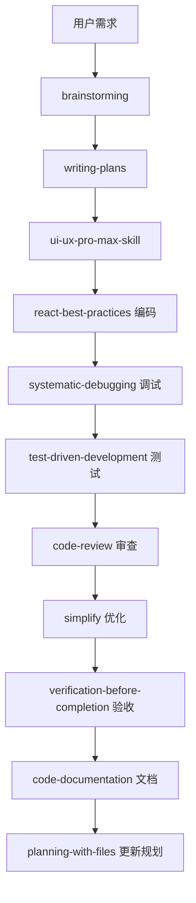
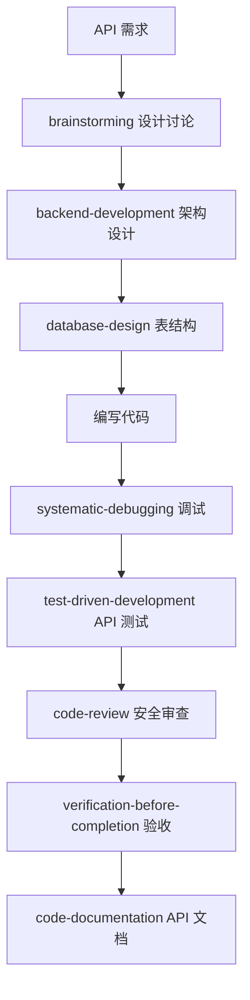

# Skills 使用路线图 - Phase 5 & Phase 6

规划时间：2024-03-06
当前进度：Phase 4 完成，准备进入 Phase 5

---

## 📍 当前状态

**已完成：**
- ✅ Phase 1-3: 前端组件 + Mock 数据 + Context API
- ✅ Phase 4: 质量保证（测试、Bug 修复、安全审查、Error Boundary、性能优化、文档、UI/UX 完善）
- ✅ Gemini UI/UX 工作验收（95% 完成，1个 Bug 已修复）

**当前应用状态：**
- Vite 开发服务器：http://localhost:5173/
- 数据存储：localStorage（浏览器本地）
- 前端框架：React 18.3.1 + Context API
- Mock 数据：18条日记 + 6个标签 + 4个科目 + 3条错题

**项目质量：**
- 代码质量：⭐⭐⭐⭐⭐
- 用户体验：⭐⭐⭐⭐⭐
- 安全性：✅ 通过审查
- 性能：✅ 已优化

---

## 🎯 Phase 5: 高级功能实现

### 任务清单

#### 5.1 番茄钟计时器 ⏱️
**优先级：** P0（最高）
**预计时间：** 2-3 小时
**复杂度：** 中

**使用 Skills：**

1. **brainstorming** - 功能设计前的头脑风暴
   ```
   触发条件：开始番茄钟功能设计时
   用途：探索用户需求、设计交互流程、考虑边界情况
   输入："设计一个考研日记应用中的番茄钟计时器，需要考虑哪些功能和交互细节？"
   ```

2. **ui-ux-pro-max-skill** - 界面设计
   ```
   触发条件：设计番茄钟 UI 时
   用途：创建现代化、Apple 风格的番茄钟界面
   输入："创建一个番茄钟计时器组件，要求：
   - Apple 风格设计
   - 圆形进度指示器
   - 暗色/亮色主题支持
   - 动画流畅"
   ```

3. **react-best-practices** - 代码实现
   ```
   触发条件：编写番茄钟组件时
   用途：确保性能最优、符合 React 最佳实践
   关键点：
   - 使用 setInterval 需要正确清理
   - 避免不必要的重渲染
   - 状态管理优化
   ```

4. **test-driven-development** - 功能测试
   ```
   触发条件：实现番茄钟后
   用途：验证计时器准确性、暂停恢复功能
   测试场景：
   - 25 分钟倒计时准确性
   - 暂停/恢复功能
   - 番茄钟完成通知
   - 休息时间切换
   ```

**实现步骤：**
1. 使用 brainstorming 探索功能需求
2. 使用 ui-ux-pro-max-skill 设计 UI
3. 创建 `src/components/Pomodoro.jsx`（可能已存在，需检查）
4. 集成到 DiaryContext（保存番茄钟记录）
5. 使用 test-driven-development 验证功能
6. 使用 simplify 优化代码质量

---

#### 5.2 科目进度追踪可视化 📊
**优先级：** P0（最高）
**预计时间：** 3-4 小时
**复杂度：** 中高

**使用 Skills：**

1. **brainstorming** - 数据可视化设计
   ```
   输入："如何设计一个直观的科目进度追踪系统？
   需求：
   - 显示 4 个科目（政治、英语、数学、专业课）
   - 进度百分比可视化
   - 学习时长统计
   - 错题数量关联"
   ```

2. **ui-ux-pro-max-skill** - 图表设计
   ```
   用途：创建进度条、环形图、柱状图等可视化组件
   样式：glassmorphism（毛玻璃风格）或 minimalism（极简风格）
   图表类型：环形进度图、垂直进度条
   ```

3. **react-best-practices** - 数据处理
   ```
   关键点：
   - 使用 useMemo 缓存计算结果
   - 避免在 render 中进行复杂计算
   - Chart.js 或 Recharts 集成（可选）
   ```

4. **code-documentation** - API 文档
   ```
   用途：记录进度计算算法、数据结构
   文档位置：src/utils/progressCalculator.js
   ```

**实现步骤：**
1. brainstorming 确定可视化方案（进度条 vs 环形图）
2. ui-ux-pro-max-skill 设计图表样式
3. 创建 `src/components/StudyProgress.jsx`
4. 实现进度计算逻辑（基于日记内容、标签、错题数）
5. 集成到 DiaryContext
6. 使用 code-documentation 记录算法

---

#### 5.3 AI 助手集成 🤖
**优先级：** P1（高）
**预计时间：** 4-6 小时
**复杂度：** 高

**使用 Skills：**

1. **brainstorming** - AI 功能设计
   ```
   输入："考研日记应用中的 AI 助手可以提供哪些功能？
   考虑：
   - 日记总结
   - 知识点答疑
   - 学习建议
   - 错题分析"
   ```

2. **backend-development** - API 集成设计
   ```
   用途：设计 AI API 调用架构
   关键点：
   - API 密钥安全存储
   - 请求限流
   - 错误处理
   - 流式响应（Streaming）
   ```

3. **code-review** - 安全审查
   ```
   触发条件：AI 功能实现后
   检查项：
   - API 密钥不泄露到前端日志
   - 用户输入清理（防止 prompt injection）
   - 错误消息不暴露敏感信息
   ```

4. **react-best-practices** - 异步状态管理
   ```
   关键点：
   - 使用 useState + useEffect 管理加载状态
   - 取消未完成的请求（AbortController）
   - 流式响应的 UI 更新
   ```

**实现步骤：**
1. brainstorming 确定 AI 功能范围
2. backend-development 设计 API 调用逻辑
3. 创建 `src/components/AIPanel.jsx`（可能已存在）
4. 集成 OpenAI/Claude/Gemini API
5. 添加流式响应支持
6. code-review 安全检查

**API 选项：**
- OpenAI GPT-4 API
- Anthropic Claude API
- Google Gemini API
- 本地 Ollama（离线方案）

---

#### 5.4 图片上传与预览 🖼️
**优先级：** P2（中）
**预计时间：** 2-3 小时
**复杂度：** 中

**使用 Skills：**

1. **brainstorming** - 图片管理策略
   ```
   输入："如何在本地日记应用中管理图片？
   考虑：
   - 存储位置（localStorage vs IndexedDB vs File System）
   - 图片压缩
   - 预览功能
   - 删除管理"
   ```

2. **ui-ux-pro-max-skill** - 图片库设计
   ```
   用途：设计图片上传区域、预览画廊
   参考：Pinterest 风格瀑布流、Instagram 风格网格
   ```

3. **react-best-practices** - 文件处理
   ```
   关键点：
   - 使用 FileReader API 读取图片
   - 使用 Canvas API 压缩图片
   - 懒加载优化
   - 内存管理（释放 Object URL）
   ```

4. **code-refactoring** - 代码优化
   ```
   触发条件：实现后
   优化点：
   - 提取图片压缩工具函数
   - 复用预览组件
   - 统一错误处理
   ```

**实现步骤：**
1. brainstorming 确定存储方案（推荐 IndexedDB）
2. ui-ux-pro-max-skill 设计上传 UI
3. 创建 `src/components/ImageGallery.jsx`
4. 实现图片压缩（目标：每张 < 500KB）
5. 集成到 Editor 和 DiaryContext
6. code-refactoring 优化代码

---

#### 5.5 导出功能（Markdown、PDF）📤
**优先级：** P2（中）
**预计时间：** 3-4 小时
**复杂度：** 中高

**使用 Skills：**

1. **brainstorming** - 导出格式设计
   ```
   输入："如何导出日记数据？
   格式选项：
   - Markdown（带 Front Matter）
   - PDF（带样式）
   - JSON（备份）
   - HTML（网页查看）"
   ```

2. **pdf** - PDF 生成
   ```
   触发条件：实现 PDF 导出时
   用途：使用 jsPDF 或 Puppeteer 生成 PDF
   功能：
   - 多页布局
   - 字体嵌入（支持中文）
   - 图片嵌入
   - 样式保留
   ```

3. **code-documentation** - 导出格式文档
   ```
   用途：记录导出格式规范
   内容：
   - Markdown Front Matter 结构
   - PDF 布局规则
   - JSON Schema
   ```

4. **test-driven-development** - 导出测试
   ```
   测试场景：
   - 单条日记导出
   - 批量导出
   - 空日记处理
   - 特殊字符转义
   ```

**实现步骤：**
1. brainstorming 确定导出格式
2. 实现 Markdown 导出（最简单）
3. 使用 pdf 技能实现 PDF 导出
4. 添加批量导出功能
5. test-driven-development 验证功能
6. code-documentation 记录格式规范

**库选择：**
- Markdown：无需库，直接字符串拼接
- PDF：jsPDF + jsPDF-AutoTable
- JSON：JSON.stringify
- HTML：模板字符串

---

## 🔧 Phase 6: 后端开发

### 任务清单

#### 6.1 Node.js + Express API 服务 🚀
**优先级：** P1（高）
**预计时间：** 6-8 小时
**复杂度：** 高

**使用 Skills：**

1. **brainstorming** - API 设计讨论
   ```
   输入："设计一个日记应用的 RESTful API，需要哪些端点？
   考虑：
   - CRUD 操作
   - 筛选和搜索
   - 认证授权（可选）
   - 数据同步"
   ```

2. **backend-development** - API 实现
   ```
   触发条件：设计 API 架构时
   用途：
   - Express.js 路由设计
   - 中间件配置
   - 错误处理
   - 日志记录
   ```

3. **database-design** - 数据库架构
   ```
   用途：设计 SQLite 表结构
   表设计：
   - entries（日记）
   - tags（标签）
   - mistakes（错题）
   - subjects（科目）
   - settings（设置）
   ```

4. **test-driven-development** - API 测试
   ```
   工具：Jest + Supertest
   测试场景：
   - CRUD 端点
   - 边界条件
   - 错误处理
   - 并发请求
   ```

5. **code-review** - API 安全审查
   ```
   检查项：
   - SQL 注入防护
   - XSS 防护
   - CORS 配置
   - Rate limiting
   ```

**实现步骤：**
1. brainstorming 设计 API 端点
2. 使用 database-design 设计表结构
3. 创建 `backend/` 目录
4. 使用 backend-development 实现 Express 服务器
5. 集成 better-sqlite3
6. test-driven-development 编写测试
7. code-review 安全审查

**API 端点设计（示例）：**
```
GET    /api/entries           # 获取所有日记
GET    /api/entries/:date     # 获取指定日期日记
POST   /api/entries           # 创建日记
PUT    /api/entries/:date     # 更新日记
DELETE /api/entries/:date     # 删除日记

GET    /api/tags              # 获取所有标签
POST   /api/tags              # 创建标签
PUT    /api/tags/:id          # 更新标签
DELETE /api/tags/:id          # 删除标签

GET    /api/mistakes          # 获取错题
POST   /api/mistakes          # 添加错题
PUT    /api/mistakes/:id      # 更新错题
DELETE /api/mistakes/:id      # 删除错题

GET    /api/settings          # 获取设置
PUT    /api/settings          # 更新设置
```

---

#### 6.2 前后端联调 🔄
**优先级：** P1（高）
**预计时间：** 4-5 小时
**复杂度：** 中高

**使用 Skills：**

1. **systematic-debugging** - 调试工具
   ```
   触发条件：遇到前后端通信问题时
   用途：
   - 网络请求失败诊断
   - CORS 问题解决
   - 数据格式不匹配追踪
   ```

2. **test-driven-development** - 集成测试
   ```
   测试场景：
   - 前端发起请求，后端响应
   - 错误处理（网络断开、超时）
   - 数据一致性
   ```

3. **verification-before-completion** - 完工验证
   ```
   触发条件：声称联调完成前
   验证项：
   - 所有 CRUD 操作通过测试
   - 错误处理正确
   - 无控制台错误
   ```

**实现步骤：**
1. 将 DiaryContext 改为调用后端 API
2. 处理异步加载状态
3. 添加错误处理和重试逻辑
4. systematic-debugging 解决问题
5. test-driven-development 集成测试
6. verification-before-completion 完工验证

---

#### 6.3 数据同步功能 ☁️
**优先级：** P2（中）
**预计时间：** 6-8 小时
**复杂度：** 高

**使用 Skills：**

1. **brainstorming** - 同步策略设计
   ```
   输入："如何设计一个可靠的数据同步机制？
   考虑：
   - 冲突解决（last-write-wins vs CRDT）
   - 离线优先（Offline-first）
   - 增量同步
   - 版本控制"
   ```

2. **backend-development** - 同步 API
   ```
   用途：实现 /api/sync 端点
   功能：
   - 增量同步（只传输变更）
   - 冲突检测
   - 时间戳比较
   ```

3. **react-best-practices** - 离线支持
   ```
   技术：
   - Service Worker
   - IndexedDB（离线缓存）
   - Background Sync API
   ```

4. **test-driven-development** - 同步测试
   ```
   测试场景：
   - 正常同步
   - 冲突场景
   - 网络中断恢复
   - 并发写入
   ```

**实现步骤：**
1. brainstorming 确定同步策略
2. backend-development 实现同步端点
3. 前端添加离线检测
4. 实现冲突解决逻辑
5. test-driven-development 测试各种场景

---

## 🛠️ 通用 Skills 使用指南

### 开发流程中的 Skills

#### 1. 每个新功能开始时
```bash
1️⃣ brainstorming          # 探索需求、设计方案
2️⃣ writing-plans          # 创建详细实现计划
3️⃣ ui-ux-pro-max-skill    # 设计 UI（如需要）
```

#### 2. 实现过程中
```bash
4️⃣ react-best-practices   # 编写 React 代码时
5️⃣ backend-development    # 编写后端代码时
6️⃣ database-design        # 设计数据库时
7️⃣ systematic-debugging   # 遇到 Bug 时
```

#### 3. 实现完成后
```bash
8️⃣ test-driven-development       # 编写测试
9️⃣ code-review                   # 代码审查
🔟 simplify                       # 代码优化
1️⃣1️⃣ verification-before-completion # 完工验证
```

#### 4. 文档和维护
```bash
1️⃣2️⃣ code-documentation          # 编写文档
1️⃣3️⃣ planning-with-files         # 更新规划文件
```

---

## 📋 Skills 优先级矩阵

| Skill | Phase 5 使用频率 | Phase 6 使用频率 | 总优先级 |
|-------|-----------------|-----------------|---------|
| **brainstorming** | ⭐⭐⭐⭐⭐ | ⭐⭐⭐⭐⭐ | P0 |
| **react-best-practices** | ⭐⭐⭐⭐⭐ | ⭐⭐⭐ | P0 |
| **ui-ux-pro-max-skill** | ⭐⭐⭐⭐⭐ | ⭐ | P0 |
| **test-driven-development** | ⭐⭐⭐⭐ | ⭐⭐⭐⭐⭐ | P0 |
| **backend-development** | ⭐ | ⭐⭐⭐⭐⭐ | P0 |
| **database-design** | ⭐ | ⭐⭐⭐⭐⭐ | P0 |
| **systematic-debugging** | ⭐⭐⭐ | ⭐⭐⭐⭐ | P1 |
| **code-review** | ⭐⭐⭐ | ⭐⭐⭐⭐ | P1 |
| **simplify** | ⭐⭐⭐ | ⭐⭐⭐ | P1 |
| **verification-before-completion** | ⭐⭐⭐ | ⭐⭐⭐ | P1 |
| **code-documentation** | ⭐⭐ | ⭐⭐⭐ | P2 |
| **planning-with-files** | ⭐⭐ | ⭐⭐ | P2 |
| **pdf** | ⭐⭐⭐ | ⭐ | P2 |
| **code-refactoring** | ⭐⭐ | ⭐⭐ | P2 |

---

## 🎯 推荐工作流

### Workflow 1: 实现单个功能（例如：番茄钟）



### Workflow 2: 后端 API 开发



---

## 📊 时间预估总表

| Phase | 任务 | 预计时间 | 使用 Skills 数量 |
|-------|------|---------|-----------------|
| **Phase 5** | | | |
| 5.1 | 番茄钟计时器 | 2-3 小时 | 4 |
| 5.2 | 科目进度可视化 | 3-4 小时 | 4 |
| 5.3 | AI 助手集成 | 4-6 小时 | 4 |
| 5.4 | 图片上传预览 | 2-3 小时 | 4 |
| 5.5 | 导出功能 | 3-4 小时 | 4 |
| **Phase 5 合计** | | **14-20 小时** | **20** |
| | | | |
| **Phase 6** | | | |
| 6.1 | Express API | 6-8 小时 | 5 |
| 6.2 | 前后端联调 | 4-5 小时 | 3 |
| 6.3 | 数据同步 | 6-8 小时 | 4 |
| **Phase 6 合计** | | **16-21 小时** | **12** |
| | | | |
| **总计** | | **30-41 小时** | **32** |

---

## 🚀 下一步行动建议

### 立即开始（推荐顺序）

**选项 A：先完成前端功能（Phase 5）**
1. 番茄钟计时器（最实用）
2. 科目进度可视化（数据驱动）
3. 导出功能（用户需要）
4. 图片上传（体验增强）
5. AI 助手（锦上添花）

**选项 B：先搭建后端（Phase 6）**
1. Express API 服务器
2. SQLite 数据库集成
3. 前后端联调
4. 数据同步功能

**选项 C：并行开发（需要分工）**
- Claude：后端 API 开发
- Gemini：前端功能实现

### 我的建议 🌟

**推荐选项 A：先完成前端功能**

**理由：**
1. 前端功能用户可立即体验
2. 不依赖后端，风险低
3. 可以逐步验证需求
4. localStorage 足够应对单用户场景

**第一步：番茄钟计时器**
- 最实用的功能
- 实现相对简单
- 可以快速验证 Skills 使用流程

---

## 📝 总结

**Skills 路线图核心思想：**
1. **每个功能开始前先 brainstorming**
2. **实现过程使用对应的专业 Skill**
3. **完成后必经 test-driven-development**
4. **最后 verification-before-completion 验收**

**预期成果：**
- Phase 5 完成后：功能完整的考研日记应用（纯前端）
- Phase 6 完成后：支持多设备同步的完整应用

**质量保证：**
- 32 个 Skills 全程护航
- 每个功能都经过设计、实现、测试、审查、验收五道关卡

---

**准备好开始了吗？** 🚀

建议从 **Phase 5.1 番茄钟计时器** 开始，使用以下 Skills 顺序：
1. brainstorming
2. ui-ux-pro-max-skill
3. react-best-practices
4. test-driven-development
5. verification-before-completion

---

创建时间：2024-03-06
更新时间：2024-03-06
