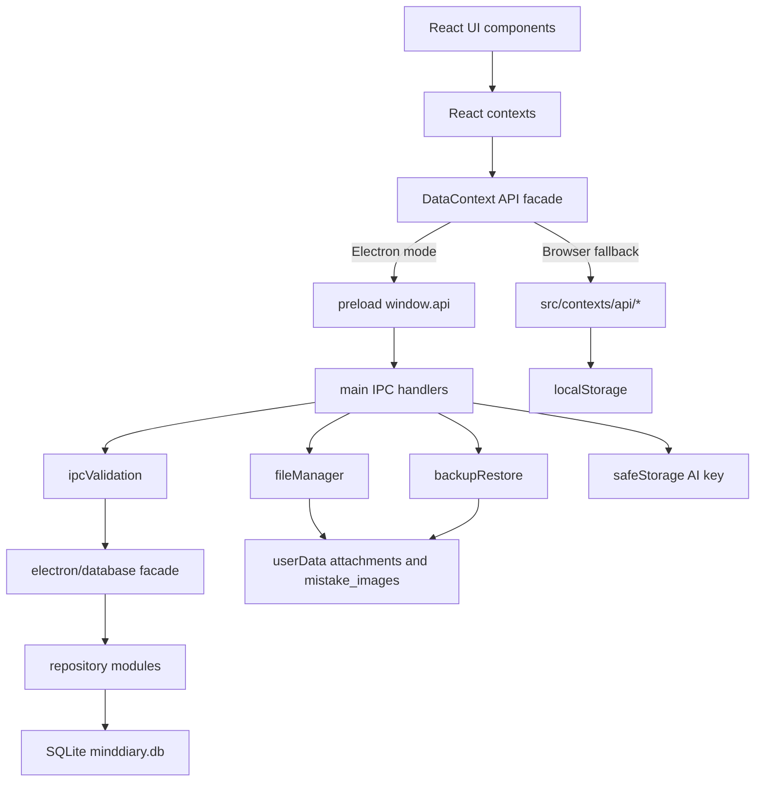
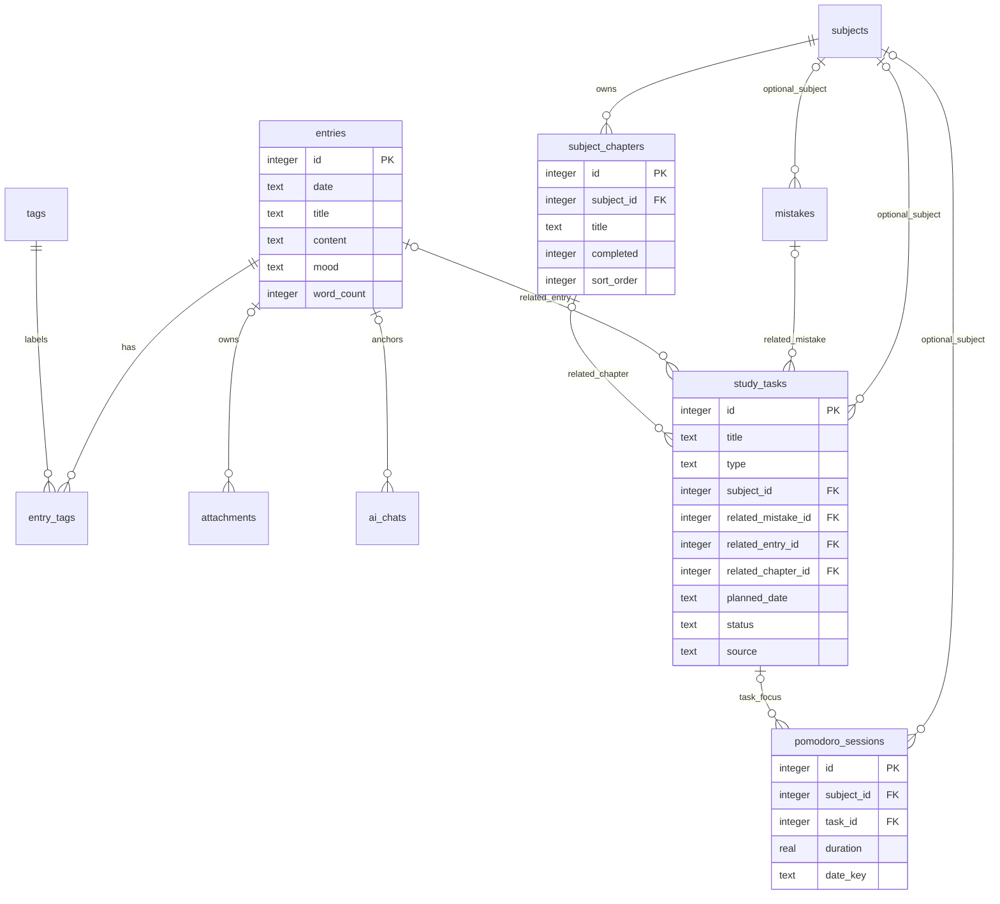

# MindDiary v1.13.0 System Map

Status: audit document for baseline `v1.13.0`.

Scope: verified against the current checkout on `main` at `e35d17a45564b9e7c6e9e7f2ff04f84b63eeed81`.

Schema status: schema unchanged. This audit does not introduce schema 6 or modify existing migrations.

## Classification Legend

- Verified fact: directly supported by files or validation in this checkout.
- Inference: derived from verified facts but not directly executed end-to-end in Electron UI.
- Risk: behavior that can fail or drift under plausible changes.
- Pending confirmation: requires packaged app, manual UI, or release environment validation.

## High-Level Architecture

Verified fact:

- `package.json` declares app version `1.13.0`, Electron entry `electron-dist/electron/main.js`, `build:electron`, `typecheck`, `test`, and Electron packaging scripts.
- `electron/main.ts` owns the Electron app lifecycle, browser window, protocol handling, IPC handlers, settings sanitization, auto backup, ZIP restore entrypoint, updater, and export handlers.
- `electron/preload.ts` exposes a narrow `window.api` bridge. Renderer code does not get Node integration; `electron/main.ts` creates the window with `contextIsolation: true` and `nodeIntegration: false`.
- `src/main.tsx` imports `src/utils/mockApi.ts`, mounts React, and wraps the app in `DataProvider`, `SettingsProvider`, `LocalDateProvider`, `PomodoroProvider`, and `DiaryProvider`.
- `src/contexts/DataContext.tsx` selects Electron IPC APIs when `IS_ELECTRON` is true and localStorage-backed browser fallback APIs otherwise.
- SQLite persistence is centralized in `electron/database.ts`, `electron/databaseMigrations.ts`, and `electron/repositories/*`.
- Browser fallback persistence is split across `src/contexts/api/*Api.ts` and localStorage keys from `src/data/mockData.ts`.

## Process Responsibilities

### Main Process

Verified fact:

- Database initialization: `electron/database.ts` opens `minddiary.db`, rejects newer schema versions, enables WAL and foreign keys, runs migrations, and creates repository instances.
- IPC boundary: `electron/main.ts` registers handlers for entries, tags, settings, attachments, subjects, subject chapters, Pomodoro, study tasks, dashboard, mistakes, AI, export, backup restore, focus guard, and updater.
- Validation boundary: `electron/ipcValidation.ts` validates task fields including `subject_id`, `related_mistake_id`, `related_entry_id`, and `related_chapter_id`.
- File boundary: `electron/fileManager.ts` stores attachments under `userData/attachments` and mistake images under `userData/mistake_images`.
- Local file protocol: `electron/pathSecurity.ts` resolves `local://` paths through realpath checks under `userData`.
- Backup boundary: `electron/backupRestore.ts` validates stored ZIP entries, manifest version, entry allowlist, and rollback media snapshots.
- Secret boundary: `electron/settingsSecurity.ts` strips `aiApiKey`; `electron/database.ts` encrypts AI keys with Electron `safeStorage` when available.

### Renderer Process

Verified fact:

- `src/App.tsx` owns high-level navigation and Pomodoro widget composition.
- `src/components/HomeDashboard.tsx` owns the daily execution entrance and next-action recommendation.
- `src/components/StudyProgress.tsx` owns subjects, detailed chapters, and "add chapter to today" task creation.
- `src/contexts/PomodoroContext.tsx` owns focus session state, active task binding, Pomodoro session persistence, task completion settlement, optional chapter completion settlement, and focus review append behavior.
- `src/components/Pomodoro.tsx` renders task selection and timer controls.
- `src/components/PomodoroAlert.tsx` renders completion/settlement choices.
- `src/components/TodayActionSuggestionDialog.tsx` and `src/components/ReviewTaskPickerDialog.tsx` create AI/dashboard review tasks using `related_mistake_id` and `related_entry_id`.

## IPC Boundary Map

Verified fact:

| Domain | Preload API | Main handler | Data implementation |
| --- | --- | --- | --- |
| Entries | `window.api.entries.*` | `entries:*` | `electron/repositories/entriesRepository.ts` |
| Tags | `window.api.tags.*` | `tags:*` | `electron/repositories/tagsRepository.ts` |
| Settings | `window.api.settings.*` | `settings:*` | `electron/database.ts`, `electron/settingsSecurity.ts` |
| Attachments | `window.api.attachments.*` | `attachments:*` | `electron/fileManager.ts`, `electron/repositories/attachmentsRepository.ts` |
| Subjects | `window.api.subjects.*` | `subjects:*` | `electron/repositories/subjectsRepository.ts` |
| Subject chapters | `window.api.subjectChapters.*` | `subjectChapters:*` | `electron/repositories/subjectChaptersRepository.ts` |
| Pomodoro | `window.api.pomodoro.*` | `pomodoro:*` | `electron/repositories/pomodoroRepository.ts` |
| Study tasks | `window.api.tasks.*` | `tasks:*` | `electron/repositories/studyTasksRepository.ts` |
| Today dashboard | `window.api.todayDashboard.getData` | `todayDashboard:getData` | `electron/database.ts#getTodayDashboard` |
| Mistakes | `window.api.mistakes.*` | `mistakes:*` | `electron/repositories/mistakesRepository.ts` |
| AI | `window.api.ai.*` | `ai:*` | `electron/aiService.ts` |
| Export | `window.api.export.*` | `export:*` | `electron/exportHandlers.ts` |
| Focus guard | `window.api.focusGuard.getActiveApp` | `focusGuard:getActiveApp` | `electron/focusGuard.ts` |

## Data Flow Diagram

## Entity Relationship Diagram

## Core Module Evidence

| Module | UI to data path | Data field to UI path | Evidence |
| --- | --- | --- | --- |
| Study tasks | `HomeDashboard` creates/completes/skips/deletes through `tasksAPI`; `StudyProgress` creates chapter tasks; `PomodoroContext` starts/completes focus tasks | `StudyTask.related_*`, `status`, `source`, `estimate_minutes`, and `planned_date` render in `HomeDashboard`, `Pomodoro`, and settlement dialogs | `src/components/HomeDashboard.tsx`, `src/components/StudyProgress.tsx`, `src/contexts/PomodoroContext.tsx`, `electron/repositories/studyTasksRepository.ts`, `src/contexts/api/tasksApi.ts` |
| Subject chapters | `SubjectChapterPanel` actions go through `StudyProgress` and `subjectChaptersAPI` | `subject_chapters.sort_order/completed/title` drive progress, next incomplete chapter, task source labels, Pomodoro settlement | `electron/repositories/subjectChaptersRepository.ts`, `src/contexts/api/subjectChaptersApi.ts`, `src/utils/subjectChapters.ts`, `src/utils/todayExecution.ts` |
| Pomodoro | `Pomodoro` and `PomodoroAlert` call `PomodoroContext` actions, which write `pomodoro_sessions` | `pomodoro_sessions.task_id` and `duration` feed task focus metrics and subject stats | `src/contexts/PomodoroContext.tsx`, `electron/repositories/pomodoroRepository.ts`, `src/utils/taskFocusMetrics.ts` |
| Diary | `Editor` and dashboard diary prompts call entries API | `entries.date/content/word_count` feed calendar, dashboard, diary settlement, export | `electron/repositories/entriesRepository.ts`, `src/contexts/api/entriesApi.ts`, `src/components/HomeDashboard.tsx` |
| Mistake book | mistake components call mistakes API and image APIs | `mistakes.next_review_date/mastered/ease_factor/image_path/answer_image_path` feed review, AI suggestions, task creation | `electron/repositories/mistakesRepository.ts`, `src/contexts/api/mistakesApi.ts`, `src/components/MistakeBook.tsx`, `src/components/ReviewTaskPickerDialog.tsx` |
| Settings and AI key | Settings UI writes patch APIs | `settings:getAll` returns stripped/masked key state, not plaintext key | `electron/main.ts`, `electron/settingsSecurity.ts`, `electron/database.ts`, `src/contexts/SettingsContext.tsx` |
| Backup/export | Settings restore calls `settings:restoreBackupFromZip`; export UI calls export handlers | Backup data table allowlist includes schema 5 task/chapter fields; sensitive settings stripped | `electron/backupRestore.ts`, `electron/databaseBackupData.ts`, `electron/exportHandlers.ts` |

## Current Strengths

Verified facts:

- The task system has an explicit IPC validation layer and matching repository/fallback normalization for task-related nullable IDs.
- `study_tasks.related_chapter_id` is nullable and uses `ON DELETE SET NULL` in SQLite migration 5.
- Browser fallback simulates chapter delete and clear-detailed semantics by nulling matching `related_chapter_id`.
- Task ordering has a deterministic status order and `created_at`, `id` tie-breakers in both SQLite and fallback task APIs.
- ZIP restore rejects traversal, absolute paths, compressed/encrypted entries, ZIP64, bad CRC, and unsupported top-level entries.
- AI API keys are not returned through settings payloads and are not included in normalized backups.
- Release asset staging uses an explicit root-level allowlist, not recursive globs.

## Current Fragile Points

Risks:

- Documentation drift is real: `README.md`, `docs/v2-roadmap.md`, `docs/v2-version-breakdown.md`, and `docs/release-checklist.md` still contain older schema/version statements while `package.json`, `RELEASE_NOTES.md`, and `electron/databaseMigrations.ts` show v1.13.0/schema 5.
- Subject list ordering differs between Electron SQLite and browser fallback: SQLite orders subjects by `name`, fallback orders by `order`. This is outside the task recommendation query but can change progress-page display order across environments.
- Several non-task aggregate/list queries have no stable secondary tie-breaker, including Pomodoro stats by equal total minutes and mistakes with equal `created_at`. Evidence supports risk, not a confirmed user-facing bug.
- `src/utils/mockApi.ts` is a lightweight development stub and does not mirror all fallback persistence semantics. The real browser fallback path is `DataContext` plus `src/contexts/api/*Api.ts`.
- Native `better-sqlite3` ABI can drift after Electron rebuilds. This checkout initially had Electron ABI while Node tests needed Node ABI; `npm rebuild better-sqlite3` fixed it.

## Future Change Hotspots

Risk:

- Adding task fields requires updates in `src/types/index.ts`, `electron/ipcValidation.ts`, `electron/databaseMigrations.ts`, `electron/databaseBackupData.ts`, `electron/repositories/studyTasksRepository.ts`, `src/contexts/api/tasksApi.ts`, tests, and export/backup compatibility docs.
- Changing chapter deletion semantics must update both SQLite FK behavior and browser fallback simulation in `subjectChaptersApi` and `subjectsApi`.
- Changing recommendation ordering must keep `studyTasksRepository` and `tasksApi.sortTasks` aligned and should add parity fixtures.
- Changing Pomodoro settlement must preserve idempotency guards in `PomodoroContext`, especially `sessionSettlementInFlightRef`, `taskSettlementInFlightRef`, and the latest-task `related_chapter_id` recheck.
- Changing backup restore must keep media rollback and DB transaction failure modes aligned; partial media replacement is the most sensitive boundary.

## Evidence Gaps

Pending confirmation:

- Packaged app manual validation was not performed yet in this document pass.
- End-to-end Electron UI behavior for chapter task creation and Pomodoro settlement still needs manual verification in a running app after build.
- Release asset contents for the already published GitHub Release were not re-audited here; release workflow and scripts were inspected.
