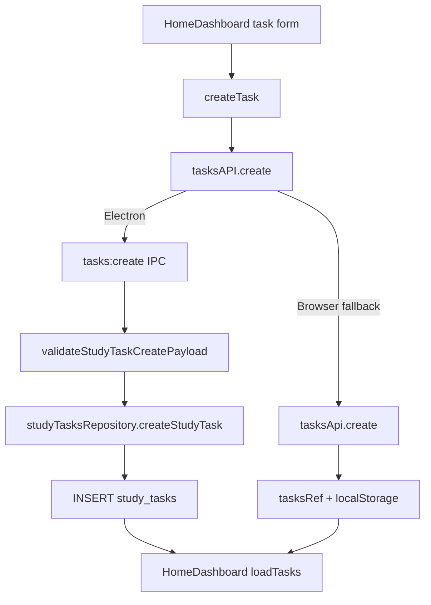
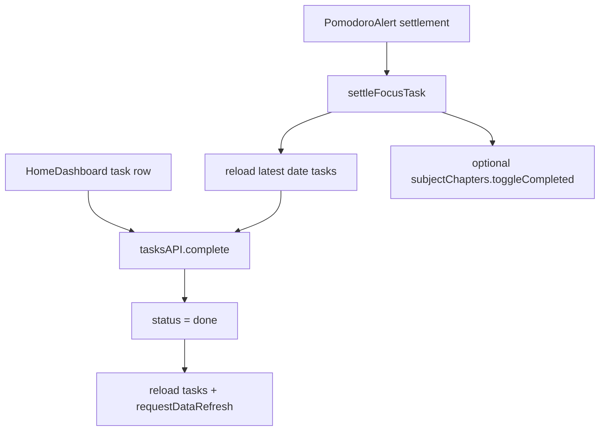
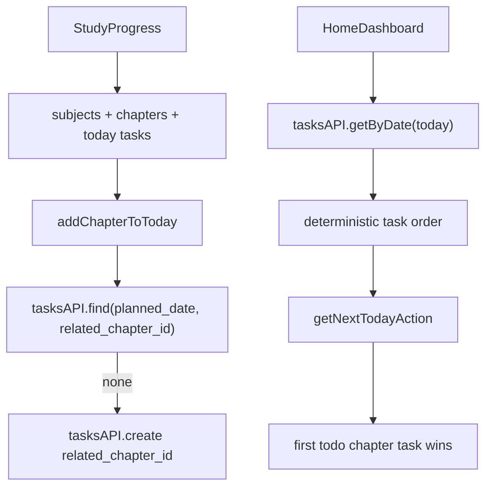
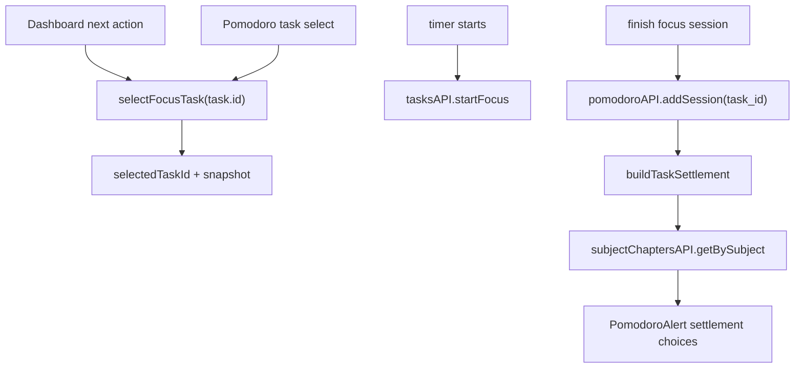
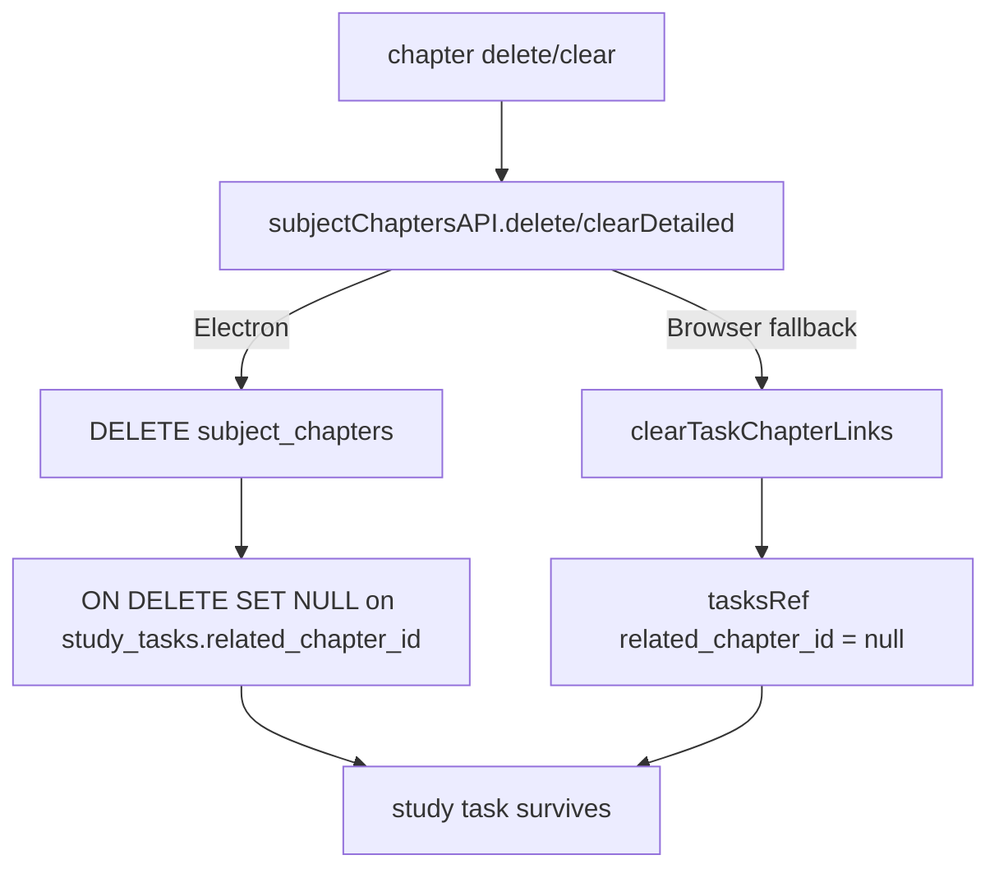
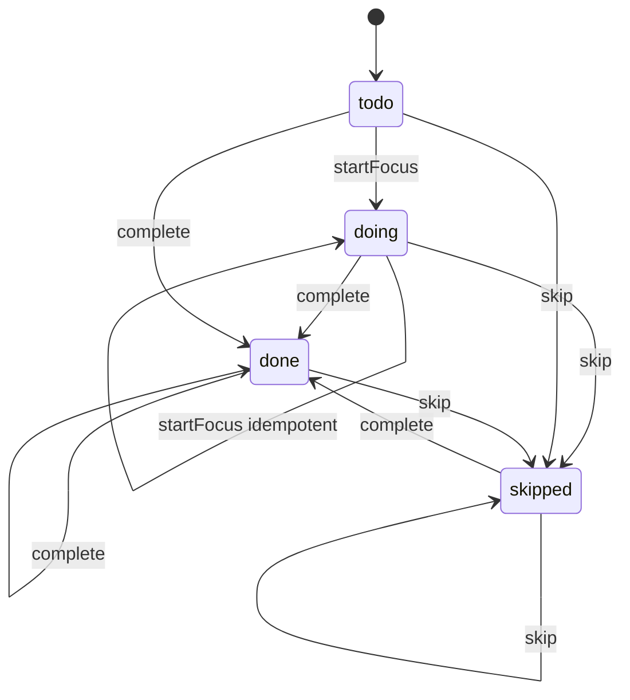

# MindDiary v1.13.0 Task System Deep Audit

Status: task lifecycle audit for v1.13.0.

Schema status: schema unchanged.

Primary evidence:

- UI entries: `src/components/HomeDashboard.tsx`, `src/components/StudyProgress.tsx`, `src/components/Pomodoro.tsx`, `src/components/PomodoroAlert.tsx`.
- State orchestration: `src/contexts/PomodoroContext.tsx`, `src/utils/todayExecution.ts`.
- SQLite data path: `electron/main.ts`, `electron/ipcValidation.ts`, `electron/repositories/studyTasksRepository.ts`, `electron/repositories/subjectChaptersRepository.ts`, `electron/repositories/pomodoroRepository.ts`.
- Browser fallback path: `src/contexts/DataContext.tsx`, `src/contexts/api/tasksApi.ts`, `src/contexts/api/subjectChaptersApi.ts`, `src/contexts/api/pomodoroApi.ts`.
- Tests: `tests/HomeDashboard.test.tsx`, `tests/StudyProgress.test.tsx`, `tests/PomodoroContext.test.tsx`, `tests/todayExecution.test.ts`, `tests/DataContext.test.tsx`, `tests/databaseRepositories.test.ts`, `tests/studyTaskParity.test.ts`.

## Flow 1: Task Creation

Verified fact:

- Manual task creation in `HomeDashboard` provides `title`, `type`, `planned_date`, `estimate_minutes`, and `source`.
- `studyTasksRepository.createStudyTask` fills defaults, validates enums/date/title/estimate, validates chapter attribution when present, and inserts the row.
- `tasksApi.create` mirrors the same defaulting and validation in browser fallback.

Risk:

- `created_at` format differs between SQLite and fallback. Task ordering remains aligned when timestamps are comparable strings and ids are tie-breakers; strict shape tests must normalize or project around timestamp format.

## Flow 2: Task Completion

Verified fact:

- Dashboard completion directly calls `tasksAPI.complete`.
- Pomodoro settlement calls `tasksAPI.complete` only after reloading the latest task list and handling task-not-found.
- Chapter completion from Pomodoro is allowed only when `completeTask` is true, the latest task still has the same `related_chapter_id`, and the chapter still exists and is incomplete.

Risk:

- Future code that toggles chapter completion without rechecking latest task attribution could complete a stale chapter after task reassignment.

## Flow 3: Chapter Task Recommendation

Verified fact:

- `StudyProgress.addChapterToToday` prevents duplicate same-day chapter tasks by querying `planned_date` and `related_chapter_id`.
- `HomeDashboard` fetches today's tasks and passes them to `getNextTodayAction`.
- `getNextTodayAction` prioritizes active focus, doing task, then first todo task with `related_chapter_id !== null`.
- The "first" chapter task is deterministic because task APIs return ordered results.

Risk:

- If any caller bypasses `tasksAPI.getByDate` and passes unsorted tasks to `getNextTodayAction`, recommendations can depend on input array order.

## Flow 4: Pomodoro Binding For Chapter Task

Verified fact:

- `PomodoroContext` persists active task selection in runtime state and active session storage.
- `addPomodoroSessionRecord` writes `task_id` into `pomodoro_sessions`.
- `buildTaskSettlement` resolves chapter details at settlement time and sets `relatedChapterId` to null if the chapter is missing.
- `PomodoroAlert` only offers chapter completion when the settlement has a chapter id/title and the chapter is not already completed.

Risk:

- Browser fallback can function without schema, but if `related_chapter_id` is missing from legacy task objects, `DataContext` normalization is required before UI logic reads it.

## Flow 5: Chapter Delete Set-Null

Verified fact:

- SQLite migration 5 defines `study_tasks.related_chapter_id` with `ON DELETE SET NULL`.
- Browser fallback explicitly maps matching `related_chapter_id` to null when deleting or clearing chapters.
- `tests/studyTaskParity.test.ts` verifies the same task survives with `related_chapter_id: null` in both paths.

## State Machine

Verified fact:

- `startFocus` rejects `done` and `skipped`.
- `startFocus` returns an already `doing` task unchanged.
- `complete` and `skip` are status updates through the same update validation path; the dashboard disables only the action matching the current terminal status, so `done` and `skipped` can be changed to one another.
- There is no dedicated task defer or restore command; those concepts are represented by status updates through `skip`, `complete`, or the general update API.

## Sorting Logic

Verified fact:

- SQLite task queries order by status CASE, `created_at ASC`, `id ASC`.
- Browser fallback task queries sort by `STATUS_ORDER`, `created_at.localeCompare`, `id`.
- `tests/studyTaskParity.test.ts` verifies the same input task fixture yields identical full rows and order after timestamps are controlled.

Potential issue:

- `getNextTodayAction` itself does not sort; it depends on caller-provided order. Current callers use `tasksAPI.getByDate`, but the utility contract is implicit.

## Recommendation Logic

Verified fact:

- `getNextTodayAction` is deterministic given ordered tasks and state flags.
- Recommendation precedence is active focus, doing task, todo chapter task, then ordinary todo task. Add-chapter is selected only when there are no tasks and incomplete chapters remain; otherwise the result is a review action.
- Completed and skipped tasks are not selected as next task actions.

Potential issue:

- "has incomplete chapters" is derived from subject summary counts, not necessarily actual detailed chapter rows. This is acceptable for existing summary subjects but can produce an add-chapter CTA that sends the user to progress rather than creating a task directly.

## Ghost Reference Risks

| Risk | Status | Evidence | Priority |
| --- | --- | --- | --- |
| Task keeps deleted chapter id | Evidence supports non-issue through repository/API paths | SQLite FK + fallback clear links + parity test | Low |
| Task keeps deleted mistake id | Evidence supports non-issue through repository/API paths | FK + fallback `mistakesApi.delete` | Low |
| Task keeps deleted entry id | Evidence supports non-issue through repository/API paths | FK + fallback `entriesApi.delete` | Low |
| Pomodoro keeps deleted task id | Evidence supports non-issue through repository/API paths | migration 3 FK + fallback task delete | Low |
| Chapter settlement completes stale chapter | Guarded in current code | latest-task `related_chapter_id` check | Low |
| Recommendation unstable under unsorted input | Potential issue | utility depends on caller sorting | P3 |

## Current Test Coverage

Verified fact:

- UI recommendation: `tests/HomeDashboard.test.tsx`.
- Pure recommendation utility: `tests/todayExecution.test.ts`.
- Chapter add-to-today flow: `tests/StudyProgress.test.tsx`.
- Pomodoro task/chapter settlement: `tests/PomodoroContext.test.tsx`.
- SQLite repository chapter task behavior: `tests/databaseRepositories.test.ts`.
- Browser fallback behavior: `tests/DataContext.test.tsx`.
- Cross-path fixture parity: `tests/studyTaskParity.test.ts`.

## Missing Tests

Recommended:

- Add a pure utility contract test showing `getNextTodayAction` expects ordered tasks or explicitly sorts its input. Prefer documenting the contract first; sorting inside the utility could hide caller bugs.
- Add a Pomodoro cancellation/interruption browser fallback regression test if future work changes active session persistence.
- Add a task timestamp format compatibility test only if timestamps become user-visible or exported as normalized values.

## Recommended Fix Priority

P1: none confirmed.

P2: none confirmed in v1.13.0 task core after new parity tests.

P3:

- Document and eventually align subject list ordering between SQLite and browser fallback.
- Add deterministic secondary tie-breakers for non-task aggregate lists.
- Make `getNextTodayAction` input ordering contract explicit in docs or tests.
